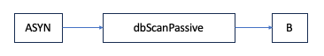

# Database Locking, Scanning, And Processing

## Overview

This section will give an overview of three closely related topics: Database locking, scanning, and processing.
Locking (mutual exclusion) is done to prevent two different tasks from simultaneously modifying related database records.
Database scanning is the mechanism for deciding when records should be processed.
The basics of record processing involves obtaining the current value of input fields and outputting the current value of output fields.
As records become more complex so does the record processing.

One powerful feature of the database is that records can contain links to other records.
This feature also causes considerable complication.
Thus, before discussing locking, scanning, and processing, record links are described.

## Record Links

A database record may contain links to other records. Links can carry data, 
including some metadata items like timestamps and alarm values. Links can also propagate record processing.
Each link is one of the following types:

- INLINK
- OUTLINK

INLINKs and OUTLINKs can be one of the following:

 - constant link (`CONSTANT`).

   As the name indicates, the link contains a constant data item. Not discussed further in this chapter.

 - database link (`DB_LINK`).

   A link to another record in the same IOC.

 - channel access link (`CA_LINK`).

   A link to a record in another IOC.
   It is accessed via a special IOC client task.
   It is also possible to force a link to be a channel access link even it references a record in the same IOC.

 - hardware link

   Not discussed in this chapter. 

 - FWDLINK

   A forward link refers to a record that should be processed whenever the record containing the forward link is processed.
   The following types are supported:

    - constant link

      Ignored.

     - database link

       A link to another record in the same IOC.

     - channel access link

        A link to a record in another IOC or a link forced to be a channel access link.
        Unless the link references the PROC field it is ignored.
        If it does reference the PROC field a channel access put with a value of 1 is issued.


Links are defined in file {doc}`epics-base:dbLink_h`.

```{note}
This chapter discusses mainly database links.
```

## Link Operations

The basic operations which can be performed on a link (excluding hardware links)
are as follows.

 - {external+epics-base:cpp:func}`dbGetLink`:
   The value of the field referenced by the input link retrieved.

 - {external+epics-base:cpp:func}`dbPutLink`:
   The value of the field referenced by the output link is changed.

 - `dbScanPassive`:
   The record referred to by the forward link is processed if it is passive.


A forward link only points to a (normally passive) record that should be processed after the record that contains the link.

For input and output links, two additional attributes can be specified by the application developer: process passive, and maximize severity.

### Process Passive

The Process Passive attribute takes the value `NPP` (Non-Process Passive) or `PP` (Process Passive).
It determines if the linked record should be processed before getting a value from an input link or after writing a value to an output link.
The linked record will be processed only if link's Process Passive attribute is `PP` and the target record's `SCAN` field is Passive.

```{note}
Three other options may also be specified:
CA, CP, and CPP. These options force the link to be handled like a Channel Access Link.
See the [Channel Access](#channel-access-links) section for details.
```

### Maximize Severity

The Maximize Severity attribute is one of `NMS` (Non-Maximize Severity), `MS` (Maximize Severity),
`MSS` (Maximize Status and Severity) or `MSI` (Maximize Severity if Invalid).
It determines whether alarm severity is propagated across links.
If the attribute is `MSI` only a severity of `INVALID_ALARM` is propagated; settings of `MS` or `MSS`
propagate all alarms that are more severe than the record's current severity.
For input links the alarm severity of the record referred to by the link is propagated to the record containing the link.
For output links the alarm severity of the record containing the link is propagated to the record referred to by the link.
If the severity is changed the associated alarm status is set to `LINK_ALARM`, except if the attribute is `MSS`
when the alarm status will be copied along with the severity.

The method of determining if the alarm status and severity should be changed is called "maximize severity".
In addition to its actual status and severity, each record also has a new status and severity.
The new status and severity are initially 0, which means `NO_ALARM`.
Every time a software component wants to modify the status and severity, it first checks the new severity and only makes a change if the severity it wants to set is greater than the current new severity.
If it does make a change, it changes the new status and new severity, not the current status and severity.
When database monitors are checked, which is normally done by a record processing routine, the current status and severity
are set equal to the new values and the new values reset to zero.
The end result is that the current alarm status and severity reflect the highest severity outstanding alarm.
If multiple alarms of the same severity are present the alarm status reflects the first one detected.

## Database Locking


Locking is required to prevent corruption of record fields due to concurrent access by different threads.
Record locking can either be done for a single record with `dbScanLock`,
or for a list of records with `dbScanLockMany`.

Before any record field is accessed, the record must be locked by calling either `dbScanLock` or `dbScanLockMany`.

Further details on the algorithms used to implement locking operations can be found in section [Record Locking Algorithms](#locking-algo).

### Single Record Locking

```C
dbScanLock(struct dbCommon *precord);
dbScanUnlock(struct dbCommon *precord);
```

A single record may be locked for access with a call to `dbScanLock` and unlocked later with a call to `dbScanUnlock`.

A thread must only lock one record at a time with `dbScanLock`, except as discussed in section [Recursive Locking](#recursive-locking).

### Multi-Record Locking

```C
typedef struct dbLocker dbLocker;
dbLocker *dbLockerAlloc(struct dbCommon **precs,
                        size_t nrecs,
                        unsigned int flags);

void dbLockerFree(dbLocker *);
void dbScanLockMany(dbLocker*);
void dbScanUnlockMany(dbLocker*);
```

It is possible to lock multiple records safely using `dbScanLockMany`.
First a `dbLocker*` must be created from an array of record pointers.
This object can be used to lock and unlock that particular group of records as many times as necessary with `dbScanLockMany`.

`dbScanLockMany` may not be called recursively.
After calling `dbScanLockMany` a thread must call `dbScanUnlockMany`
with the same `dbLocker*` before calling `dbScanLockMany` again.

`dbScanLock` may be called recursively as described in section \ref{sec:recursivelocking}.

The first argument to `dbScanLockMany` is an array of `dbCommon*`
(i.e pointers to record instances), and the second is the number of elements in this array.
The array may contain duplicate elements.
Elements may be NULL.

The third argument to `dbScanLockMany` (`flag`) must be zero since no flags are defined at present.

(recursive-locking)=
### Recursive Locking

Recursive locking is an attempt by a thread to lock a record which it has already locked.
As for example:

```C
/* This is valid recursive locking */
dbCommon *prec = ...;
dbScanLock(prec);
dbScanLock(prec);
dbScanUnlock(prec);
dbScanUnlock(prec);
```

But not:

```C
/* This is NOT valid */
dbCommon *prec1 = ..., *prec2 = ...;
assert(prec1!=prec2);
dbScanLock(prec1);
dbScanLock(prec2); /* potential deadlock here! */
dbScanUnlock(prec2);
dbScanUnlock(prec1);
```

The rules for recursive locking with `dbScanLock` and `dbScanLockMany` are as follows:

  - `dbScanLockMany` does not support recursion.
     A single thread can only hold one group lock (`dbLocker*`) at a time.
  - `dbScanLock` may be used to recursively lock a record.
  - `dbScanLock` may be used on a record which is already locked with `dbScanLockMany`.


Therefore the following is valid.

```C
/* This is valid multi-locking */
dbCommon *precs[2] = {prec1, prec2};
dbLocker *L = dbLockerAlloc(precs, 2, 0);
dbScanLockMany(L);
dbScanLock(precs[0]);
dbScanUnlock(precs[0]);
dbScanLock(precs[1]);
dbScanUnlock(precs[1]);
dbScanUnlockMany(L);
dbLockerFree(L);
```

### When to lock

A record is always locked while it is being processed by the IOC.
So Device and Record Support code must never call `dbScanLock` nor `dbScanLockMany` from within any support callback function.

However, asynchronous device support may explicitly call `dbScanLock` when the asynchronous operation completes from a user thread or `CALLBACK`.

The functions `dbPutField` and `dbGetField` implicitly call `dbScanLock` or `dbScanLockMany`.
The functions `dbPut` and `dbGet` do not.


All records connected by any kind of database link are placed in the same lock set.
Versions of EPICS Base prior to R3.14 allowed an NPP NMS input link to span two different lock sets, but this was not safe when the read and write operations on the field value were not atomic in nature.
This feature is no longer available to break a lockset.

## Database Scanning


Database scanning refers to requests that database records be processed.
Four types of scanning are possible:

 1. Periodic - Records are scanned at regular intervals.

 2. I/O event - A record is scanned as the result of an I/O interrupt.

 3. Event - A record is scanned as the result of any task issuing a `post_event` request.

 4. Passive - A record is scanned as a result of a call to `dbScanPassive`.
  `dbScanPassive` will issue a record processing request if and only if the record is passive and is not already being processed.


A `dbScanPassive` request results from a task calling one of the following routines:

 - dbScanPassive: Only the record processing routines `dbGetLink`, `dbPutLink`, and `dbPutField` call the `dbScanPassive` routine.
   Record processing routines call it for each forward link in the record.

 - dbPutField: This routine sets the target field value and then, if the field was marked `pp(TRUE)` it calls `dbScanPassive`.
   Each field of each record type has an attribute `pp` declared as either `TRUE` or `FALSE` in the record definition file.
   The attribute is a global property which is set by the record type.
   This use of `pp` only affects calls to the `dbPutField` routine.
   If `dbPutField` finds the record already active (this can happen to asynchronous records) and it is supposed to cause it to process, it arranges for it to be processed again once the current processing completes.

 - dbGetLink:  If the link includes the process passive flag `PP` this routine first calls `dbScanPassive` to process the target record.
   Whether or not `dbScanPassive` was called, it then obtains the value from the target field.

 - dbPutLink:  This routine sets the target field.
   Then, if the link includes the process passive flag `PP` it calls `dbScanPassive` to process the target record.
    `dbPutLink` is only called from record processing routines.
    If `dbPutLink` finds the record already active because of a `dbPutField` directed to this record then it arranges for the record to be processed again later, once the current processing completes.

All non-record processing tasks (Channel Access, Sequence Programs, etc.) call `dbGetField` to obtain database values.
`dbGetField` just reads values without asking that a record be processed.

## Record Processing

A record is processed as a result of a call to `dbProcess`.
Each record support module must supply a routine `process`.
This routine does most of the work related to record processing.
Since the details of record processing are record type specific this topic is discussed in greater detail in the chapter "Record Support".

## Guidelines for Creating Database Links

The ability to link records together is an extremely powerful feature of the IOC software.
In order to use links properly it is important that the Application Developer understand how they are processed.
As an introduction consider the following example:


Assume that A, B, and C are all passive records.
The notation states that A has a forward link to B and B to C.
C has an input link obtaining a value from A.
Assume, for some reason, A gets processed.
The following sequence of events occurs:


 -  A begins processing.
    While processing a request is made to process B.

 -  B starts processing.
    While processing a request is made to process C.

 -  C starts processing.
    One of the first steps is to get a value from A via the input link.

 - At this point a question occurs.
   Note that the input link specifies process passive (signified by the `PP` after `InLink`).
   But process passive states that A should be processed before the value is retrieved.
   Are we in an infinite loop?
   The answer is no.
   Every record contains a field `PACT` (processing active), which is set `TRUE` when record processing begins and is not set `FALSE` until all processing completes.
   When C is processed A still has `PACT` `TRUE` and will not be processed again.

 - C obtains the value from A and completes its processing.
   Control returns to B.

 -  B completes returning control to A

 -  A completes processing.

This brief example demonstrates that database links need more discussion.

### Rules Relating to Database Links

#### Processing Order

The processing order follows the following rules:

 1. Forward links are processed in order from left to right and top to bottom. For example the following records are 
processed in the order `FLNK1`, `FLNK2`, `FLNK3`, `FLNK4` .


 2. If a record has multiple input links (such as the calculation or select records) the input values are nornally fetched in the natural order.
 For example for link fields named `INPA`, `INPB`, ..., `INPL`, the links would be read in the order A, B, C etc.
 Thus if obtaining an input results in a record being processed, the processing order is guaranteed.
 Some record types may not follow this rule however.

 3. All input and output links are processed before the forward link.

#### Lock Sets

All records, except for the conditions listed in the next paragraph, linked together directly or indirectly are placed in the same lock set.
When `dbScanLock` or `dbScanLockMany` is called the entire set, not just the specified record, is locked.
This prevents two different tasks from simultaneously modifying records in the same lock set.

#### PACT - Process Active

Every record contains a field `PACT`.
This field is set `TRUE` at the beginning of record processing and is not set `FALSE` until the record is completely processed.
To prevent infinite processing loops, whenever a record gets processed through a forward link, or a database link with the `PP` link option, the linking record's `PACT` field is saved and set to `TRUE`, then restored again afterwards.
The example given at the beginning of this section gives an example.
It will be seen in the next two sections that `PACT` has other uses.

#### Process Passive: Link option

Input and output links have an option called process passive.
For each such link the application developer can specify process passive `TRUE` (`PP`) or process passive `FALSE` (`NPP`).
Consider the following example:


Assume that all records except fanout are passive.
When the fanout record is processed the following sequence of events occur:

 1. Fanout starts processing and asks that B be processed.

 2. B begins processing.
    It calls `dbGetLink` to obtain data from A.

 3.  Because the input link has process passive true, a request is made to process A.

 4. A is processed, the data value fetched, and control is returned to B

 5. B completes processing and control is returned to fanout.
    Fanout asks that C be processed.

 6. C begins processing.
    It calls `dbGetLink` to obtain data from A.

 7. Because the input link has process passive `TRUE`, a request is made to process A.

 8. A is processed, the data value fetched, and control is returned to C.

 9. C completes processing and returns to fanout

 10. The fanout completes


Note that A was processed twice. This is unnecessary.
If the input link to C were declared No Process Passive then A would only be processed once.
Thus a better solution would be:


#### Process Passive: Field attribute

All record type field definitions have an attribute called `process_passive` 
which is specified in the record definition file.
It cannot be changed by an IOC application developer.
This attribute is used only by `dbPutField`.
It determines if a passive record will be processed after `dbPutField` sets a field in the record.
Consult the record specific information in the record reference manual for the setting of individual fields.

#### Maximize Severity: Link option

Input and output links have an option called maximize severity.
For each such link the application developer can specify the option as `MS` (Maximize Severity), `NMS` (Non-Maximize Severity), `MSS` (Maximize Status and Severity) or `MSI` (Maximize Severity if Invalid).

When database input or output links are defined, the application developer can use this option to specify whether and how alarm severities should be propagated across links with the data.
The alarm severity is transferred only if the new severity will be greater than the current severity of the destination record.
If the severity is propagated the alarm status is set equal to `LINK_ALARM` (unless the link option is `MSS` when the alarm status will also be copied from the source record).

## Guidelines for Synchronous Records

A synchronous record is a record that can be completely processed without waiting.
Thus the application developer never needs to consider the possibility of delays when he defines a set of related records.
The only consideration is deciding when records should be processed and in what order a set of records should be processed.

The following reviews the methods available to the application programmer for deciding 
when to process a record and for enforcing the order of record processing.

 1. A record can be scanned periodically (at one of several rates), via I/O event, or via Event.

 2. For each periodic group and for each Event group the `PHAS` field can be used to specify processing order.

 3. The application programmer has no control over the record processing order of records in different groups.

 4. The disable fields (`SDIS`, `DISA`, and `DISV`) can be used to disable records from being processed.
  By letting the `SDIS` field of an entire set of records refer to the same input record, the entire set can be enabled or disabled simultaneously.
  See the Record Reference for details.

 5. A record (periodic or other) can be the root of a set of passive records that will all be processed whenever the root record is processed.
  The set is formed by input, output, and forward links.

 6. The `process_passive` attribute of each record field determines if a passive record will be processed when a `dbPutField` is directed to the field.
  The application developer must be aware of the possibility of record processing being triggered by external sources using this mechanism.

 7. The `process_passive` option for input and output links provides the application developer control over how a set of records are scanned.

 8. General link structures can be defined.
    The application programmer should be wary, however, of defining arbitrary structures without carefully analyzing the processing order. 

## Guidelines for Asynchronous Records

The previous discussion does not cover asynchronous device support.
An example might be a GPIB input record.
When the record is processed the GPIB request is started and the processing routine returns.
Processing, however, is not really complete until the GPIB request completes.
This is handled via an asynchronous completion routine.
Let's state a few attributes of asynchronous record processing.

During the initial processing for all asynchronous records the following is done:

 1. `PACT` is set `TRUE`

 2. Data is obtained for all input links

 3. Record processing is started

 4. The record processing routine returns

The asynchronous completion routine performs the following algorithm:

 1. Record processing continues

 2. Record specific alarm conditions are checked

 3. Monitors are raised

 4. Forward links are processed

 5. `PACT` is set `FALSE`.


A few attributes of the above rules are:

 1. Asynchronous record processing does not delay the scanners.

 2.  Between the time that record processing begins and the asynchronous completion routine completes, no attempt will be made to again process the record.
   This is because `PACT` is `TRUE`.
  The routine `dbProcess` checks `PACT` and does not call the record processing routine if it is `TRUE`.
Note, however, that if `dbProcess` finds the record active 10 times in succession, it raises a `SCAN_ALARM`.

 3. Forward and output links are triggered only when the asynchronous completion routine completes record processing.

With these rules the following works just fine:




When `dbProcess` is called for record ASYN, processing will be started but `dbScanPassive` will not be called.
Until the asynchronous completion routine executes any additional attempts to process ASYN are ignored.
When the asynchronous callback is invoked the `dbScanPassive` is performed.

Problems still remain. A few examples are:

### Infinite Loop

Infinite processing loops are possible.


Assume both A and B are asynchronous passive records and a request is made to process A.
The following sequence of events occur.


 1. A starts record processing and returns leaving `PACT` `TRUE`.

 2. Sometime later the record completion for A occurs.
    During record completion a request is made to process B.
    B starts processing and control returns to A which completes leaving its `PACT` field `FALSE`.

 3. Sometime later the record completion for B occurs.
    During record completion a request is made to process A.
     A starts processing and control returns to B which completes leaving its `PACT` field `FALSE`.


Thus an infinite loop of record processing has been set up.
It is up to the application developer to prevent such loops.

### Obtain Old Data

A `dbGetLink` to a passive asynchronous record can get old data.


If A is a passive asynchronous record then record B's `dbGetLink` request forces `dbProcess` 
to be called for record A.
`dbProcess` starts the processing but returns immediately, before the operation has finished.
`dbGetLink` then reads the field value which is still old because processing will only be completed at a later time.

### Delays

Consider the following:


The second ASYN record will not begin processing until the first completes, etc.
This is not really a problem except that the application developer must be aware of delays caused by asynchronous records.
Again, note that scanners are not delayed, only records downstream of asynchronous records.

## Cached Puts

The rules followed by `dbPutLink` and `dbPutField` provide for "cached" puts.
This is necessary because of asynchronous records.
Two cases arise.

The first results from a `dbPutField`, which is a put coming from outside the database, i.e. Channel Access puts.
If this is directed to a record that already has `PACT` `TRUE` because the record started processing but asynchronous completion has not yet occurred, then a value is written to the record but nothing will be done with the value until the record is again processed.
In order to make this happen `dbPutField` arranges to have the record reprocessed when the record finally completes processing.

The second case results from `dbPutLink` finding a record already active because of a `dbPutField` 
directed to the record.
In this case `dbPutLink` arranges to have the record reprocessed when the record finally completes processing.
If the record is already active because it appears twice in a chain of record processing, it is not reprocessed because the chain of record processing would constitute an infinite loop.

Note that the term caching not queuing is used.
If multiple requests are directed to a record while it is active, each new value is placed in the record but it will still only be processed once, i.e. last value wins.

## processNotify

`dbProcessNotify` is used when a Channel Access client calls `ca_put_callback` and makes a request to notify the caller when all records processed as a result of this put are complete.
Because of asynchronous records and conditional use of database links between records this can be complicated and the set of records that are processed because of a put cannot be determined in advance.
The processNotify system is described in section \ref{Process Notify Subsystem} on page \pageref{Process Notify Subsystem}.
The result of a `dbProcessNotify` with type `putProcessRequest` is the same as a `dbPutField` except for the following:

 - `dbProcessNotify` requests are queued rather than cached.
    Thus when additional requests are directed to a record that already has an active `dbProcessNotify`, they are queued.
    As each one finishes it releases the next one in the queue.

 -  If a `dbProcessNotify` links to a record that is not active but has a `dbProcessNotify` attached to it, no attempt is made to process the record.


## Channel Access Links

A channel access link is:


 1. A record link that references a record in a different IOC.

 2. A link that the application developer forces to be a channel access link.

A channel access client task (dbCa) handles all I/O for channel access links.
It does the following:


 - At IOC initialization, dbCa issues channel access search requests for each channel access link.

 - For each input link it establishes a channel access monitor, using the channel's native field type and element count.
  It also monitors the alarm status.
  Whenever the monitor callback gets invoked the new data is stored in a buffer belonging to dbCa.
  When iocCore or the record support module asks for data from the link, the contents of the buffer are converted to the requested type.

 - For each output link, a buffer is allocated the first time iocCore/record support issues a put after the channel access connection has been made.
  This buffer is allocated large enough to store the channel's native field type and element count
  Each time iocCore/record support issues a put, the data is converted and placed in the buffer and a request is made to dbCa to issue a new `ca_put`.

Even if a link references a record in the same IOC it can be useful to force it to act like a channel access link.
In particular the records will not be forced to be in the same lock set.
As an example consider a scan record that links to a set of unrelated records, each of which can cause a lot of records to be processed.
It is often NOT desirable to force all these records into the same lock set.
Forcing the links to be handled as channel access links solves the problem.

CA links which connect between IOCs incur the extra overhead associated with message passing protocols, operating system calls, and network activity.
In contrast, CA links which connect records in the same IOC are executed more efficiently by directly calling database access functions such as `dbPutField` and `dbGetField`, or by receiving callbacks directly from a database monitor subscription event queue.

Because channel access links interact with the database only via `dbPutField`, `dbGetField` and use a database monitor subscription event queue, their interaction with the database is fundamentally different from database links which are tightly integrated within the code that executes database records.
For this reason and because channel access does not support the passing of a process passive flag, the semantics of channel access links are not the same as database links.
Let's discuss the channel access semantics of INLINK, OUTLINK, and FWDLINK separately.

### INLINK

The options for process passive are:

 - Input links always act like NPP.

 - CA - Forces the link to be a channel access link.

 -  CP - Forces the link to be a channel access link and also requests that the record containing the link be processed whenever a monitor occurs.

 -  CPP - Force the link to be a channel access link and also requests that the record containing the link, if it is passive, be processed whenever a monitor occurs.

Maximize Severity is honored.

### OUTLINK

The options for process passive are:

 - It is not possible to honor PP or NPP options; the put operation completes immediately but whether the destination record will process depends on the process passive attribute of the destination field.

 -  CA - Force the link to be a channel access link.

Maximize Severity is not honored.

### FWDLINK

A channel access forward link is honored only if it references the `PROC` field of a record.
In that case a `ca_put` with a value of 1 is performed each time a forward link request is issued.
Because of this implementation, the requirement that a forward link can only point to a passive record does not apply to channel access forward links;
the target record will be processed irrespective of the value of its `SSCAN` field.

The available options are:


- CA - Force the link to be a channel access link.

Maximize Severity is not honored.

(locking-algo)=
## Record Locking Algorithms

This section describes details of the implementation of `dbScanLock` and `dbScanLockMany`.
Any discussion of links and linking in this section refers only to database links (`DB_LINK`).
Other link types do not require record locking.

A lockset guards one or more records with an `epicsMutexId`.
Each lockset maintains a list of its member records.

The relationship between a record and a lockset forms the basis of the locking algorithms.
Every record is always a member of some lockset throughout its lifetime.
However, a record may move between locksets.
The relationship between record and lockset is established in the `lockRecord*` private structure which is the `LSET` field of each record.
Each `lockRecord` structure includes an `epicsSpin*` to maintain its consistency.

Records are associated with each other through links with the 
`DBF_INLINK`, `DBF_OUTLINK`, and `DBF_FWDLINK` field types.
These links are directional, from the record with the link field, to the field of the record it is targeted at.
This is a directed graph of records (nodes) and links (edges).

The existence of a database link between two records places them in the same lockset.
This allows database processing chains involving multiple records to maintain consistency.
Records which are not currently connected by any database link (directly or indirectly) are placed in different locksets.
This enables parallel scanning of unrelated processing chains.

When a database link is created between two records in two different locksets,
all the records in the locksets are moved into one lockset.
The other (now empty) lockset is free'd.
This is referred to as a merge operation.

Each time a database link between two records is broken it is possible that the lockset (graph)
has become partitioned (split in two).
When this occurs, a new lockset is created and populated with one set of connected records.
This is referred to as a split operation.

Access and modification of the association between record and lockset is governed by the following rules:


 - When changing the association, both the lockset mutex and the `lockRecord` spinlock must be locked.

 - When reading the association, either the lockset mutex or the `lockRecord` spinlock must be locked.

A basic property of a [spinlock](https://en.wikipedia.org/wiki/Spinlock) is that it must not be held during any blocking operation, including locking a [mutex](https://en.wikipedia.org/wiki/Lock_(computer_science)).
This defines the order of locking.
The mutex (lockset) must be locked first, then the spinlock (`lockRecord`).

This complicates things because locking operations begin with record pointer(s) (`dbCommon*`).
The spinlock must be locked first in order to find a record's current lockset.
However, the spinlock must be unlocked before the lockset can be locked.
Care must be taken as the association may change when neither is locked.
Furthermore, when two locksets are merged, one of them will be free'd.

To handle this safely, each lockset contains a reference counter.
The lockset will only be free'd when this counter falls to zero.
This counter has one "count" for each active reference.
Each `lockRecord` is an active reference.
Further, a `dbLocker` may also hold active references.

The process of locking a lockset is as follows:


 -  Lock the `lockRecord` (spinlock)
 -  Increment the reference counter of the lockset
 -  Unlock the `lockRecord`
 -  Lock the lockset (mutex)
 -  Again lock the `lockRecord`
 -  Check that the record's lockset hasn't changed
 -  Unlock the `lockRecord`
 -  Decrement the reference counter of the lockset


There remains the possibility that the association between record and lockset may change during the moment between unlocking the spinlock and locking the mutex.
This can be detected after the mutex has been locked.
When it occurs, the whole operation must be re-tried with the new lockset.

We assume that database link modification is a relatively rare operation.

Locking multiple locksets is necessary when a database link is created.
The underlying `epicsMutex` API only supports locking a single mutex in one call.
Care must be taken to avoid a deadlock when locking the second, and beyond.

Two common strategies for avoiding deadlocks are to use a try-lock operation with ownership tracking, or to establish a global ordering.
At present the second strategy is used.
All lockset mutexes are placed into a global order by comparing their memory (pointer) address.
Locking is done in order of increasing address.

Merging two locksets when a link is created is accomplished by locking both locksets, then concatenating their record lists into one.
This leaves one empty lockset.

Splitting one lockset into two when a link is broken requires finding if the lockset has become partitioned.
It is helpful to recognize that the act of removing one link between two records (say `A` and `B`) can result in at most two locksets.

To determine if a lockset has been partitioned it is sufficient to start with one of the two records (`A`), then recursively traverse the remaining links to or from record `A`.
If record `B` is encountered during this traversal, then the lockset has not been partitioned.
If all records connected to `A` can be traversed without finding `B`, then the lockset has been partitioned.
All the records connected with `A` become one lockset, while the remaining records (including `B`) become the second.

During IOC startup, the complete list of records is iterated (by `dbLockInitRecords`) and the required locksets are created and populated based on the links defined at the time.

