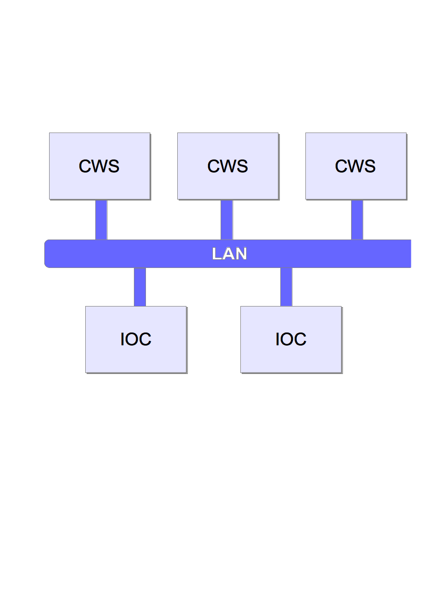
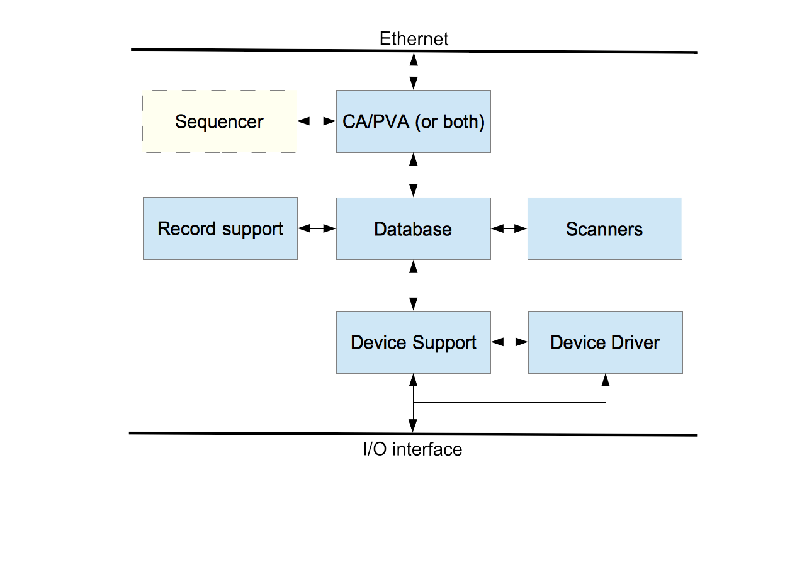

EPICS Overview
==============

What is EPICS?
--------------

The Experimental Physics and Industrial Control System (EPICS) comprises
a set of software components and tools that can be used to create
distributed control systems. EPICS provides capabilities that are
typically expected from a distributed control system:

-  Remote control & monitoring of facility equipment


-  Automatic sequencing of operations


-  Facility mode and configuration control

-  Management of common time across the facility

-  Alarm detection, reporting and logging

-  Closed loop (feedback) control [1]

-  Modeling and simulation

-  Data conversions and filtering


-  Data acquisition including image data


-  Data trending, archiving, retrieval and plotting


-  Data analysis



-  Access security (basic protection against unintended manipulation)

EPICS can scale from very big to very small systems. Big systems have to
be able to transport and store large amounts of data, be robust and
reliable but also failure-tolerant. Failure of a single component should
not bring the system down. For small installations it has to be possible
to set up a control system without requiring complicated or expensive
infrastructure components.

For modern applications, management of data is becoming increasingly important.
It shall be possible to store acquired operational data for
the long term and to retrieve it in the original form. EPICS provides the
tools to achieve this and to tailor the data management to the needs of
the facility.

One of the most appreciated aspects of EPICS is the lively collaboration
that is spread around the globe. Members of the collaboration are happy
to help other users with their issues and to discuss new ideas.

System components
~~~~~~~~~~~~~~~~~

Broadly speaking, the EPICS toolset enables creation of servers and
client applications. Servers provide access to data, reading or writing,
locally or over a network. Reading and writing is often done to and from
hardware connected to physical components, however data can also be
produced or used elsewhere. Physical I/O, however is the central task of
any control system, including EPICS.

Clients can display, store and manipulate the data. Client software
ranges from (graphical and command line) user interface tools to powerful services for
data management.

The basic components of an EPICS-based control system are:

**IOC**, the Input/Output Controller. This is the I/O server component of EPICS.
Almost any computing platform that can support EPICS basic
components like databases and network communication can be used
as an IOC. One example is a regular desktop computer, other examples are
systems based on real-time operating systems like vxWorks or RTEMS and
running on dedicated modular computing platforms like MicroTCA, VME or
CompactPCI. EPICS IOC can also run on low-cost hardware like RaspberryPi
or similar.

**CWS**, or Client WorkStation. This is a computer that can run various
EPICS tools and client applications; typical examples are user interface
tools and data archiving. CWS can be desktop computer, a server machine
or similar, and is usually running a “regular” (as opposed to real-time)
operating system like Linux, Windows or MacOS.

**LAN** Local Area Network. This is just a standard Ethernet-based (or wireless)
communication network that allows the IOCs and CWS’s to communicate.

A simple EPICS control system can be composed of one or more IOCs and Client
WorkStations that communicate over a LAN (Figure 1). Separation of
clients and servers makes configuration of the systems easier and also
makes the system more robust. Clients and servers can be added to and
removed from the system without having to stop the operation.

|image0|

Figure 1. A simple EPICS control system structure.

In addition to these basic components of a “classical” EPICS control
system, it is also possible to implement servers (aka services) for data
that are not “process I/O” (real-time values from a controlled process)
or attached to hardware. These other services can for example provide
configuration or calibration data, or computing services like particle
beam modeling. Since all the services “speak” the same protocol and
exchange the same type of data structures, the data source is transparent to the
client software (i.e., you do not need to know in advance where the data
comes from or how it is obtained.) In this sense, the IOC can be
regarded as a special type of server that handles process data and
connects to real field hardware (in many cases, but not necessarily.)

The EPICS software components Channel Access (CA) and pvAccess (PVA) provide the
protocols and structures that enable network transparent communication
between client software running on a CWS and an arbitrary number of IOCs
and other servers. More details about CA and PVA are provided in later chapters.

Basic Attributes
----------------

The basic attributes of EPICS are:

-  Tool Based: EPICS provides a set of interacting tools and components
   for creating a control system. This minimizes the need for
   customer-specific coding and helps ensure uniform operator
   interfaces.

-  Distributed: An arbitrary number of IOCs and CWSs can be supported.
   As long as the network is not saturated, there is not a single
   bottleneck. If a single IOC becomes saturated, its functions can be
   spread over several IOCs. Rather than running all applications on a
   single CWS host, the applications can be spread over many CWSs.

-  Event Driven: The EPICS software components are all designed to be
   event driven to the maximum extent possible. For example, an EPICS
   client may, instead of having to query IOCs for changes, request to
   be notified of a change. This design leads to efficient use of
   resources, as well as quick response times.

-  High Performance: An IOC can process tens of thousands of data items
   (“database records”, see below) per second. Clients and servers can
   handle systems with millions of process variables, with minimized
   network overhead.

-  Scalable: As a distributed system, EPICS can scale from systems with
   a single IOC and a few clients to large installations with hundreds
   of IOCs and millions of I/O channels and process variables.

-  Robust: failure of a single components does not bring the whole
   system down. Components (IOCs, clients) can be added to and removed
   from the system without having to stop operation of the control
   system. The components can withstand intermittent failures of the
   interconnecting network and recover automatically when the network
   recovers from failure.

-  Process-variable based: In contrast to some other control system
   packages, EPICS does not model control system (I/O) devices as
   objects (as in object-oriented programming) but rather as data
   entities that describe a single aspect of the process or device under
   control, thus the name “process variable”, or “PV”. A typical PV can
   represent any one of various attributes such as temperature or (electric)
   current. This design is typical in process control systems. The pros and
   cons of this design are shortly discussed in the Appendix.

IOC Software Components
-----------------------

An EPICS IOC at its core is a software entity or a process that contains
the following software components:

-  IOC Database: A memory resident database containing a set of named
   records of various types. The records host the process variables that
   were mentioned above.

-  Scanners: The mechanisms for processing records in the IOC database.

-  Record Support: Each record type has an associated set of record
   support routines to implement the functionality of the record type.

-  Device Support: Device support routines bind I/O data to the database
   records.

-  Device Drivers: Device drivers handle access to external devices.

-  Channel Access or pvAccess: The interface between the external world
   and the IOC. It provides the interface for accessing the (EPICS)
   database via the network.

-  Sequencer: A finite state machine. Strictly speaking, this
   is an external module and not included in the EPICS core software
   distribution.

Let us briefly describe the major components of the IOC and how they
interact.

|image1|

Figure 2. EPICS IOC components.

IOC Database
~~~~~~~~~~~~

The heart of each IOC is a process database. This database is memory
resident (i.e., not stored on a hard disk or other permanent memory
device) and has nothing to do with the more commonly known relational
(aka SQL) databases.

The database defines the functionality of the IOC: what process data it
provides, how is the data handled and stored. The database can contain
any number of records, each of which belongs to a specific record
type. The record type defines the type of data that the record handles
and a set of functions that define how the data are handled. Record
type-specific metadata, also known as “properties” is included in the
records to configure and support the operation. For instance, an analog
input (ai) record type supports reading in values from hardware devices
and converting them into desired (engineering) units. It also provides
limits for expected operating ranges and alarms when these limits are
exceeded. EPICS supports a large and extensible set of record types,
e.g. ai (Analog Input), ao (Analog Output), etc.

The metadata, known as “fields” is used to configure the record’s
behavior. There are a number of fields that are common to all record
types while some fields are specific to particular record types. Every
record has a record name and every field has a field name. The record
name must be unique across all IOCs that are attached to the same TCP/IP
subnet, to enable the client software to discover any record on the
subnet and to access its value and other fields.

::

  record(ai, "Cavity1:T") #type = ai, name = “Cavity1:T”
  {
    field(DESC, “Cavity Temperature”) #description
    field(SCAN, “1 second”) #record update rate
    field(DTYP, “XYZ ADC”) #Device type
    field(INP, “#C1 S4”) #input channel
    field(PREC, “1”) #display precision
    field(LINR, “typeJdegC”) #conversion spec
    field(EGU, “degrees C”) #engineering units
    field(HOPR, “100”) #highest value on GUI
    field(LOPR, “0”) #lowest value on GUI
    field(HIGH, “65”) #High alarm limit
    field(HSV, “MINOR”) #Severity of “high” alarm
  }

Figure 3. Example of an EPICS database record. Only a subset of fields
is defined here.

Database records can be linked with each other. For example, records can
retrieve input from other records, trigger other records to process,
enable or disable records and so on.

By linking a combination of records together, the EPICS database becomes
a programming tool. Using this, even very sophisticated functions can be
achieved with the database. In addition, as this logic resides on the
IOC, it is not dependent on any client software to work. By taking
advantage of this, many client programs can be “thin” and just display
or write the values in the database records. Figure 4 below illustrates
a simple example of record linking: if the average temperature of the
two sensors T1 and T2 is over 10 degrees, the chiller is switched on.
This database contains four records: two analog inputs (ai), one binary
output (bo) and one calculation (calc).

|image2|

Figure 4. Example of record linking. From [2].

Data structures are provided so that the database can be accessed
efficiently. Most software components do not need to be aware of these
structures because they access the database via library routines.

Database Scanning
~~~~~~~~~~~~~~~~~

Database scanning is the mechanism to process a record. Processing means
making the record perform its task, for instance reading an I/O channel,
converting the read value to engineering units, attaching a timestamp to
the value or checking the alarm limits. How data are handled when a
record is processed depends on the record type.

Four basic types of record scanning are provided: Periodic, Event, I/O
Event and Passive. All these methods can be mixed in an IOC.

-  **Periodic**: A record is processed periodically.
   A number of time intervals are supported, typically ranging from 10
   Hz to 0.01 Hz. Ranges are configurable to support higher and lower
   rates.

-  **Event**: Event scanning happens when any IOC software component
   posts an (EPICS software) event, such as a new temperature sensor
   measurement value.

-  **I/O Event**: The I/O event scanning system processes records based
   on external events like processor interrupts. An IOC device driver
   interrupt routine must be available to accept the external
   interrupts. An I/O Event does not necessarily have to be an interrupt
   in the traditional sense of a CPU interrupt, though.

-  **Passive**: Passive records are not scanned regularly or on events.
   However, they can be processed as a result when other records that
   are linked to them are processed, or as a result of external changes
   such as new values set over network using Channel Access.

Record Support, Device Support and Device Drivers
^^^^^^^^^^^^^^^^^^^^^^^^^^^^^^^^^^^^^^^^^^^^^^^^^

Access to the database does not require record type-specific knowledge;
each record type provides a set of record support routines that
implement all record-specific behavior. Therefore, IOCs can support an
arbitrary number of records and record types. Similarly, record support
contains no device specific knowledge, giving each record type the
ability to have any number of independent device support modules. If the
method of accessing the piece of hardware is more complicated than can
be handled by device support, then a device driver can be developed.
Sometimes splitting functionality between device support (when it is
record type-specific) and a driver (when the code handles
device-specific details) is a good practice.

Record types that are not associated with hardware do not need to have
device support or device drivers. One example is a calculation (“calc”)
record that reads its input from other records, performs a calculation
and then (optionally) forwards the result to other records.

The IOC software design allows a particular installation and even a
particular IOC within an installation to choose a unique set of record
types, device types, and drivers. The remainder of the IOC system
software is unaffected.

To give an overview of how the separation works, let us look at the
tasks of the record support. Every record support module must provide a
record processing routine to be called by the database scanners. Record
processing consists of some combination of the following functions (all
record types do not need all functions):

-  **Input**: Read inputs. Inputs can be obtained, via device support
   routines, from hardware, from other database records via database
   links, or from other IOCs via Channel Access (CA) or pvAccess (PVA)
   links.

-  **Conversion**: Conversion of raw input to engineering units or
   engineering units to raw output values.

-  **Output**: Write outputs. Output can be directed, via device support
   routines, to hardware, to other database records within the same IOC
   via database links, or to other IOCs via CA or PVA links.

-  **Raise Alarms**: Check for and raise alarms.

-  **Monitor**: Trigger monitors related to CA or PVA callbacks.

-  **Link**: Trigger processing of linked records.

The same concept is applied to the device support and device driver
modules: each support module has to define a set of functions so that it
can become a part of the IOC software.

Database Monitors
~~~~~~~~~~~~~~~~~

The mechanism to send notifications when a database value changes is
called “database monitors”. The monitor facility allows a client program
to be notified when database values change without having to constantly
poll the database. These can be configured to specify value changes,
alarm changes, and/or archival changes.

Database monitors are supported by the EPICS standard protocols Channel
Access and pvAccess.

Network protocols
-----------------

EPICS provides network transparent access to IOC databases by supporting
the following network protocols for data exchange.

Channel Access
~~~~~~~~~~~~~~

Channel Access is based on a client/ server model. Each IOC provides a
Channel Access server that is able to establish communication with an
arbitrary number of clients. Channel Access client services are
available on both CWSs and IOCs. A client can communicate with an
arbitrary number of servers.

Client Services
~~~~~~~~~~~~~~~

The basic Channel Access client services are:

-  **Search**: Locate the IOCs containing selected process variables and
   establish communication with each one.

-  **Get**: Get value plus additional optional information for a
   selected set of process variables.

-  **Put**: Change the values of selected process variables.

-  **Monitor**: Request to have the server send information only when
   the associated process variable changes state. Any combination of the
   following state changes can be requested: change of value, change of
   alarm status and/or severity, and change of archival value. Many
   record types provide hysteresis factors for value changes.

In addition to process variable values, any combination of the following
additional information (“metadata”) may be requested:

-  **Status**: Alarm status and severity.

-  **Units**: Engineering units for this process variable.

-  **Precision**: Precision with which to display floating-point
   numbers.

-  **Timestamp**: Time when the record was last processed.

-  **Enumeration**: A set of ASCII strings defining the meaning of
   enumerated values.

-  **Graphics**: High and low limits for configuring widgets and graphs
   on a graphical user interface (GUI).

-  **Control**: High and low control limits; operational limits for the
   record.

-  **Alarm**: The alarm status (HIHI, HIGH, LOW, and LOLO) and severity
   for the process variable.

Search Server
^^^^^^^^^^^^^

Channel Access provides an IOC resident server, which waits for Channel
Access search messages. These are UDP broadcasts that are generated by a
Channel Access client (for example when an Operator Interface task
starts) when it searches for the IOCs containing process variables it
uses. This server accepts all search messages, checks to see if any of
the process variables are located in this IOC, and, if any are found,
replies to the sender with an “I have it” message.

Connection Request Server
^^^^^^^^^^^^^^^^^^^^^^^^^

Once the process variables have been located, the Channel Access client
issues connection requests for each IOC containing process variables the
client uses. The connection request server, in the IOC, accepts the
request and establishes a connection to the client. Each connection is
managed by two separate tasks: ca_get and ca_put. The ca_add_event
requests result in database monitors being established. Database access
and/or record support routines provide the value updates (monitors) via
a call to db_post_event.

Connection Management
^^^^^^^^^^^^^^^^^^^^^

Each IOC provides a connection management service. If a Channel Access
server fails (e.g. its IOC crashes) the client is notified and when a
client fails (e.g. its task crashes) the server is notified. If a
client fails, the server breaks the connection. If a server crashes,
the client automatically re-establishes communication when the server
restarts.

pvAccess
~~~~~~~~

pvAccess is a modern replacement and an alternative to Channel Access
available in EPICS 7. PvAccess adds a number of capabilities to EPICS
that augment the set of services provided by Channel Access. With
pvAccess, structured data can be transported with a high efficiency and
is capable of handling big data sets; this has been achieved with a
number of optimizations:

-  Data structure introspection and data transport have been separated
   so that structure information needs to be carried only once per
   connection.

-  Monitors send only the items of a data structure that have changed.

-  Several under-the-hood optimizations in data manipulation have been
   made (reduce copying, etc.) In application testing pvAccess has been
   able to utilize 96-99% percent of the available theoretical bandwidth
   of a 10 Gbit Ethernet link which is close to the limit of what is
   achievable in practice.

Client Services
^^^^^^^^^^^^^^^

The basic pvAccess client services are similar to Channel Access, with a
couple of additions:

-  **Search**: Locate the IOCs that contain the process variables of
   interest and establish communication with each one.

-  **Get**: Get value plus additional optional information for a
   selected set of process variables.

-  **Put**: Change the values of selected process variables.

-  **Add Monitor**: Add a change of state callback, similar to Channel
   Access.

-  **PutGet**: Change the value of a PV, process the EPICS record and
   read back the value in one atomic operation.

-  **ChannelRPC**: A “Remote Procedure Call” [3] communication pattern.
   This is similar to PutGet, but the communication is asymmetric, i.e.,
   the data sent by client (“request”) is different from the data
   structure that the server sends back. This pattern can be described
   as a query with parameters. Examples could be to ask a calibration
   service for parameters for a certain device, or a beam physics server
   for calculated beam parameters at certain coordinates of the
   accelerator.

For the IOC, an IOC resident server (**qsrv**) provides the interface to
access the process database records. Basic access to a single PV
provides the equivalent function to channel access. In addition, qsrv
provides the possibilities to create data structures that combine data
from different database records into structures that are transported as
units. Since EPICS 3.16, the IOC core is able to guarantee atomic access
to the records, meaning that the data in the structure that qsrv
provides is guaranteed to be a result of a single processing (or better
expressed, that the records do not change their values while qsrv is
assembling the data structure.) This applies also to puts, meaning that
all values are written to the addressed records before the records are
processed. This way, coherence of parameters for an operation can be
guaranteed.

.. _search-server-1:

Search Server
^^^^^^^^^^^^^

Like in Channel Access, **qsrv** waits for search messages. The server
accepts all (UDP) search messages, checks to see if any of the process
variables are located in this IOC, and if any are found, replies to the
sender with an “I have it” message.

.. _connection-request-server-1:

Connection Request Server
^^^^^^^^^^^^^^^^^^^^^^^^^

In pvAccess, the process of how a client and a server establish the
communication channel is slightly different from Channel Access and
contains two stages. The first stage is exchanging introspection data.
In this stage, the server communicates to the client the structure of
the data to be exchanged. Both sides can then create the necessary
placeholder structures for the communication. In the second stage the
actual data can be exchanged, using the allocated data structures.

.. _connection-management-1:

Connection Management
^^^^^^^^^^^^^^^^^^^^^

pvAccess provides a connection management service similar to Channel
Access.

**EPICS database and network transport**

It should be noted that the access methods (pvAccess, Channel Access) do
**not** provide access to the EPICS database as records. This is a
deliberate design decision. This allows changes to be made in the
database structures or new record types to be added without impacting
any software that accesses the database via PVA or CA, and it allows
these clients to communicate with multiple IOCs having differing sets of
record types.

Client Workstation Tools
-------------------------

EPICS offers a range of tools and services that are executed on the
client workstations. These can be divided into two groups based on
whether or not they use Channel Access and/or pvAccess. CA/PVA tools are real
time tools, i.e. they are used to monitor and control IOCs.
These tools are not included in the EPICS "base" distribution and have to be
downloaded separately. The tools are implemented in different languages and
technologies and the users should select which tools are the best suited to
their particular setup and infrastructure.

Examples of CA/pvAccess Tools
^^^^^^^^^^^^^^^^^^^^^^^^^^^^^

A large number of CA/PVA tools have been developed. The
following are some representative examples.

-  CS-Studio: Control System Studio, an application bundle with many
   available plug-ins like display managers (BOY, Display Builder), data
   visualization/charting tools (DataBrowser), and so on.

-  EDM: Extensible Display Manager. One of the several alternative
   display managers. Other popular alternatives are caQtDM (based on the
   Qt framework), medm (Motif Extended Display Manager, a legacy tool),
   just to name a couple.

-  Alarm Handler. General-purpose alarm handler driven by an alarm
   configuration file.

-  Sequencer: Runs in an IOC to implement state machines.

-  Archiver Appliance: Collects data from EPICS servers (CA,PVA) and
   stores the data in time-series files so that they can be later
   retrieved and analyzed for correlating events and monitoring the
   performance of the “machine”, i.e., the device or facility under
   control.

-  Channel Finder (Indexing Service): A tool to manage (list, tag,
   categorize) the EPICS records in a system. This is a powerful tool to
   manage and provide hierarchy and different viewpoints to the potentially
   very large number of records. With this service, abstract views to
   the flat namespace of the records can be provided. For example,
   listing all vacuum pumps in the system, or horizontal position of the
   beam in the accelerator as measured by the Beam Position Monitors.

Examples of other Tools
^^^^^^^^^^^^^^^^^^^^^^^

• VDCT: A Java based database configuration tool, which can be used to
design and configure EPICS databases, and is able to visualize the
records and their connections.

• SNC: State Notation Compiler. It generates a C program that represents
the states for the IOC Sequencer tool.

References and further reading
------------------------------

1. Control Theory (https://en.wikipedia.org/wiki/Control_theory)

2. http://epics.web.psi.ch/training/handouts/e_EPICS_Training_at_PSI.ppt

3. https://en.wikipedia.org/wiki/Remote_procedure_call

4. EPICS Application Developer’s Manual (version dependent, see for
   instance
   http://www.aps.anl.gov/epics/base/R3-15/5-docs/AppDevGuide/AppDevGuide.html)

5. https://www.encyclopedia.com/computing/dictionaries-thesauruses-pictures-and-press-releases/atomic-action

6. `Recent Advancements and Deployments of EPICS Version
   4 <http://epics-pvdata.sourceforge.net/talks/2015/ICALEPCS2015_WEA3O02_TALK.pdf>`__,
   Greg White et. al., ICALEPCS 2015, Melbourne, Australia.

.. _appendix:

Appendix: Objects vs Process Variables discussion
-------------------------------------------------

As discussed in Chapter 2, EPICS is based on a “flat”, i.e.,
non-hierarchical set of records, which represent the Process
Variables [1]_ of the control system. This has a number of pros and
cons:

Pros:

-  Easy to adjust to any specific case without need of detailed modeling of the devices.

-  Efficient communication: only the data of interest needs to be transported.

-  PVs are modular building blocks that can be mixed and matched as needed.

-  Even complex functionality can be implemented without (traditional) programming.

Cons:

-  Lack of abstraction; control of complex entities has to be implemented on top of the PVs.

-  Management of discrete data items is hard; lack of atomic actions [4].

-  Advantages of object-oriented programming (code reuse, encapsulation, etc.) cannot be utilized.

One can extend these lists and argue about them but the above are the
most common.

There is no single truth saying that this model is better or worse than
other conceivable models. It depends on the use case and how much weight
is put on each different factor.

However, the new features in EPICS 7 have been added to mitigate the
lack of abstraction and atomic actions. The structured data model in
EPICS 7 allows construction of complex structures to represent abstract
entities. Further, these entities can be built from the existing
building blocks, thus the flexibility is retained; in a way this is even
better than strict modeling because the abstraction can be added on top
of the working system afterwards. Also, atomic actions – to the extent
they can be implemented in a distributed system – have been added, thus
removing the need of complicated workaround solutions.

.. [1]
   Strictly speaking, each field of a record can also be considered as a
   process variable. However, for this discussion it is sufficient to
   take the simpler approach to equate a record with a PV.

.. |image2| image:: media/Intro_RecordLinking.png
   :width: 6.69306in
   :height: 4.10093in
