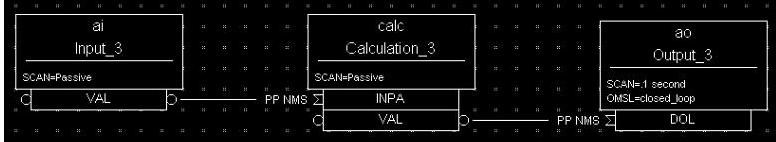
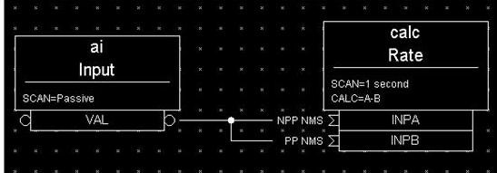
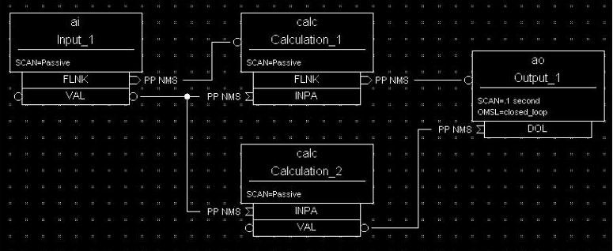

# Scanning Specification


*Scanning* determines when a record is processed.
A record is *processed* when it performs any actions related to its data.
For example,
when an output record is processed,
it fetches the value which it's to output,
converts the value,
and then writes that value to the specified location.
Each record must specify the scanning method that determines when it will be processed.
Three scanning methods are available for database records:

1. [Periodic scanning](#periodic-scanning) occurs on set time intervals.
2. [Event scanning](#Event-scanning) occurs on either an I/O interrupt event
or a user-defined event.
3. [Passive scanning](#Passive-scanning) occurs when the records linked to the passive record are scanned,
or when a value is "put" into a passive record through the database access routines.

### Phase

For periodic or event scanning,
the user can also control the order in which a set of records is processed
by using the PHASE mechanism.
The number in the `PHAS` field allows to define
the relative order in which records are processed within a scan cycle:

-  Records with `PHAS=0` are processed first

-  Then those with `PHAS=1`, `PHAS=2`, etc.

For event scanning,
the user can control the priority at which a record will process.
The `PRIO` field selects Low/Medium/High priority for Soft event and I/O Interrupts.

In addition to the scan and the phase mechanisms,
there are data links and forward processing links
that can trigger the processing of other records.

## Periodic scanning


The periodic scan tasks run as close as possible to the specified frequency.
When each periodic scan task starts,
it calls the gettime routine,
then processes all the records on this period.
After the processing,
gettime is called again
and this thread sleeps the difference between the scan period
and the time to process the records.
For example,
if it takes 100 milliseconds to process all records with “1 second” scan period,
then the 1 second scan period will start again 900 milliseconds after completion.
The following periods for scanning database records are available by default,
though EPICS can be configured to recognize more scan periods:

-  10 second

-  5 second

-  2 second

-  1 second

-  .5 second

-  .2 second

-  .1 second

You should specify the period that best fits the nature of the signal.
A five-second interval is adequate for the temperature of a mass of water
because it doesn't change rapidly.
Some power levels may change rapidly,
so they need to be scanned every 0.5 seconds.
For a continuous control loop,
where the process variable being controlled can change quickly,
the 0.1 second interval may be the optimal choice.

For a record to scan periodically,
a valid choice must be entered in its `SCAN` field.
The available choices depend on the configuration of the menuScan.dbd file.
As with most other fields which consists of a menu of choices,
you can change the choices available for the `SCAN` field
by editing the appropriate .dbd (database definition) file.
dbd files are ASCII files
that are used to generate header files
that are used to compile the database code.
dbd files can also configure things besides the choices of menu fields.

Here is an example of a menuScan.dbd file.
It has the default menu choices for all periods listed earlier,
as well as choices for event scanning,
passive scanning,
and I/O interrupt scanning:

```
  menu(menuScan) {
    choice(menuScanPassive,"Passive")
    choice(menuScanEvent,"Event")
    choice(menuScanI_O_Intr,"I/O Intr")
    choice(menuScan10_second,"10 second")
    choice(menuScan5_second,"5 second")
    choice(menuScan2_second,"2 second")
    choice(menuScan1_second,"1 second")
    choice(menuScan_5_second,".5 second")
    choice(menuScan_2_second,".2 second")
    choice(menuScan_1_second,".1 second")
  }
```
The first three choices must appear first and in the order shown.
The remaining definitions are for the periodic scan rates,
which must appear in the order slowest to fastest.
The order directly controls the thread priority assigned to the particular scan rate, 
and faster scan rates should be assigned higher thread priorities.
At IOC initialization,
the menu choice strings are read at scan initialization.
The number of periodic scan rates
and the period of each rate is determined from the menu choice strings.
Thus, the periodic scan rates can be changed by changing menuScan.dbd
and loading this version via dbLoadDatabase.
The only requirement is that each periodic choice string must begin with a number
and be followed by any of the following unit strings:

  - second or second**s**
  - minute or minute**s**
  - hour or hour**s**
  - Hz or Hertz

For example,
to add a choice for 0.015 seconds,
add the following line after the 0.1 second choice:

```
  choice(menuScan_015_second, " .015 second")
```
The range of values for scan periods can be from one clock tick
to the maximum number of ticks available on the system.
For example, vxWorks out of the box supports 0.015 second
or a maximum frequency of 60 Hz.
Note that the order of the choices is essential.
The first three choices must appear in the order in the earlier menuScan.dbd example.
Then the remaining choices should follow in descending order,
the biggest time period first and the smallest last.

## Event scanning

Two types of events are supported in the Input Output Controller (IOC) database,
the I/O interrupt event and the user-defined event.
For each type of event,
the user can specify the scheduling priority of the event using the `PRIO` or priority field.
The scheduling priority refers to the priority the event has on the stack
relative to other running tasks.
Three possible choices are available: LOW, MEDIUM, or HIGH.
A low priority event has a priority a little higher than Channel Access.
A medium priority event has a priority about equal to the median of periodic scanning tasks.
A high priority event has a priority equal to the event scanning task.

## I/O interrupt events


Scanning on I/O interrupt causes a record to process when a driver posts an I/O Event.
In many cases these events are posted in the interrupt service routine.
For example, if an analog input record gets its value from an I/O card,
and it specifies I/O interrupt as its scanning routine,
then the record will be processed each time the card generates an interrupt.
Not all types of I/O cards can generate interrupts.
Note that even though some cards can't actually generate interrupts,
some driver support modules can simulate interrupts.
In order for a record to scan on I/O interrupts,
its `SCAN` field must specify I/O Intr.

## User-defined events


The user-defined event mechanism processes records that are meaningful
under specific circumstances.
User-defined events can be generated by the post_event() database access routine.
Two records, the event record and the timer record,
are also used to post events.

For example, there is the timing output, 
generated when the process is in a state where a control can be safely changed.
Timing outputs are controlled through Timer records,
which have the ability to generate interrupts.
Consider a case where the timer record is scanned on I/O interrupt
and the timer record's event field (`EVNT`) contains an event number. 
When the record is scanned,
the user-defined event will be posted.
When the event is posted,
all records will be processed whose `SCAN` field specifies event
and whose event number is the same as the generated event.

User-defined events can also be generated through software.
Event numbers are configurable
and should be controlled through the project engineer.
They only need to be unique per IOC
because they only trigger processing for records in the same IOC.

All records that use the user-defined event mechanism must specify Event in their `SCAN` field
and an event number in their `EVNT` field.

## Passive scanning


Passive records are processed
when they're referenced by other records through their link fields
or when a channel access put is done to them.

### Channel Access puts to passive scanned records


In this case where a Channel Access put is done to a record,
the field being written has an attribute that determines if this put causes record processing.
For all records, putting to the `VAL` field causes record processing.

Consider a binary output that has a `SCAN` of Passive.
If an operator display has a button on the `VAL` field,
every time the button is pressed,
a channel access put is sent to the record.
When the `VAL` field is written,
the Passive record is processed and the specified device support is called
to write the newly converted `RVAL` to the device specified in the `OUT` field
through the device support specified by `DTYP`.

Fields determined to change the way a record behaves typically cause the record to process.
Another field that would cause the binary output to process would be the `ZSV`;
which is the alarm severity if the binary output record is in state Zero (0).
If the record was in state 0
and the severity of being in that state changed from No Alarm to Minor Alarm,
the only way to catch this on a `SCAN` Passive record is to process it.
Fields are configured to cause binary output records to process in the `bo.dbd` file.
The `ZSV` severity is configured as follows:

```
  field(ZSV,DBF_MENU) {
    prompt("Zero Error Severity")
    promptgroup(GUI_ALARMS)
    pp(TRUE)
    interest(1)
    menu(menuAlarmSevr)
  }
```

where the line `pp(TRUE)` is the sign that this record is processed when a channel access put is done.

### Database links to passive records

The records in the process database use link fields
to configure data passing and scheduling (or processing).
These fields are either `INLINK`,`OUTLINK`, or `FWDLINK` fields.

## Forward links


In the database definition file (.dbd) these fields are defined as follows:

```
  field(FLNK,DBF_FWDLINK) {
    prompt("Forward Process Link")
    promptgroup(GUI_LINKS)
    interest(1)
  }
```

If the record that's referenced by the `FLNK` field has a `SCAN` field set to “Passive” 
then the record is processed after the record with the `FLNK`.
The `FLNK` field only causes record processing,
no data is passed.

In (*Figure 1*), three records are shown,
which process as follows:
1. The ai record "Input_2" is processed periodically.
At each interval, Input_2 is processed.
After Input_2 has read the new input,
converted it to engineering units,
checked the alarm condition,
and posted monitors to Channel Access, 
then the calc record "Calculation_2" is processed. 
2. Calculation_2 reads the input,
performs the calculation,
checks the alarm condition,
and posts monitors to Channel Access,
then the ao record "Output_2" is processed.
3. Output_2 reads the desired output, rate limits it, clamps the range,
calls the device support for the `OUT` field, checks alarms, posts
monitors and then is complete.


**Figure 1. Input Links**

---

Input links normally fetch data
from one field into a field in the referring record.
For instance, if the `INPA` field of a calc record is set to `Input_3.VAL`,
then the `VAL` field is fetched from the Input_3 record
and placed in the `A` field of the calc record.
These data links have an attribute that specifies
if a passive record should be processed before the value is returned.
The default for this attribute is NPP
(no process passive).
In this case,
the record takes the `VAL` field and returns it.
If they're set to PP (process passive),
then the record is processed before the field is returned.

In *Figure 2*, the PP attribute is used.
In this example:
1. Output_3 is processed periodically.
Record processing first fetches the `DOL` field.
As the `DOL` field has the PP attribute set,
before the `VAL` field of Calc_3 is returned,
the record is processed.
2. The first thing the ai record Input_3 does is read the input.
It then converts the `RVAL` field to engineering units
and places this in the `VAL` field,
checks alarms, posts monitors, and then returns.
3. The calc record then fetches the `VAL` field from Input_3,
places it in the `A` field,
computes the calculation, checks alarms, posts monitors, the returns.
4. The ao record, Output_3,
then fetches the `VAL` field from the calc record,
applies rate of change and limits,
write the new value, checks alarms, posts monitors and completes.


**Figure 2**

---

In *Figure 3* the PP/NPP attribute is used to calculate a rate of change.
1. At 1 Hz, the calculation record is processed.
It fetches the inputs for the calc record in order.
As `INPA` has an attribute of NPP, the `VAL` field is taken from the ai record.
2. Before `INPB` takes the `VAL` field from the ai record it gets processed, 
as the attribute on this link is PP.
3. The new ai value is placed in the `B` field of the calc record. 
`A-B` is the difference between the `VAL` field of the ai one second ago and now.


**Figure 3**

---

### Process chains

Links can be used to create complex scanning logic.
In the forward link example earlier,
the processing of the chain of records is determined by the scan rate of the input record.
In the PP example,
the scan rate of the chain is determined by the scan rate of the output.
Either of these may be appropriate depending on the hardware and process limitations.

Care must be taken as this flexibility can also lead to some incorrect configurations.
These next examples cover some mistakes that can occur.

In *Figure 4*,
two records that are scanned at 10 Hz make references to the same Passive record.
In this case, no alarm or error is generated.
The Passive record is scanned twice at 10 Hz.
The time between the two scans depends on what records are processed between the two periodic records.


**Figure 4**

---

In *Figure 5*, several circular references are made.
As the record processing is recursively called for links,
the record containing the link is marked as active
during the entire time that the chain is being processed.
When one of these circular references is encountered,
the active flag is recognized and the request to process the record is ignored.


**Figure 5**

## Channel Access links

A Channel Access link is an input link or output link
that specifies a link to a record located in another IOC or an input and output link,
using one of the following attributes: CA, CP, or CPP.

### Channel Access input links

If the input link specifies CA, CP, or CPP,
regardless of the location of the process variable being referenced,
it will be forced to be a Channel Access link.
This is helpful for separating process chains that aren't tightly related.
If the input link specifies CP,
it also causes the record containing the input link to process
whenever a monitor is posted,
no matter what the record's `SCAN` field specifies.
If the input link specifies CPP,
it causes the record to be processed if and only if
the record with the CPP link has a `SCAN` field set to Passive.
In other words, CP and CPP cause the record containing the link to be processed
when the process variable that they reference changes.

### Channel Access output links

Only CA is appropriate for an output link. Writing to a field over
channel access causes processing as specified in 
[Channel Access Puts to Passive Scanned Records](#Channel-Access-Puts-to-Passive-Scanned-Records).

### Channel Access forward links

Forward links can also be Channel Access links,
either when they specify a record located in another IOC
or when they specify the CA attributes.
However, forward links will only be made Channel Access links
if they specify the `PROC` field of another record.

## Maximize Severity attribute

The Maximize Severity attribute is one of the following :

  - NMS (Non-Maximize Severity)
  - MS (Maximize Severity)
  - MSS (Maximize Status and Severity)
  - MSI (Maximize Severity if Invalid)

It determines whether alarm severity is propagated across links.
If the attribute is MSI, only a severity of INVALID_ALARM is propagated;
settings of MS or MSS propagate all alarms
that are more severe than the record's current severity.
For input links the alarm severity of the record referred to by the link
is propagated to the record containing the link.
For output links the alarm severity of the record containing the link
is propagated to the record referred to by the link.
If the severity is changed the associated alarm status is set to LINK_ALARM,
except if the attribute is MSS.
In this case the alarm status will be copied along with the severity.

The method of determining if the alarm status and severity should be changed
is called \``maximize severity".
In addition to its actual status and severity,
each record also has a new status and severity.
The new status and severity are initially 0,
which means NO_ALARM.
Every time a software component wants to modify the status and severity,
it first checks the new severity
and only makes a change if the severity it will set is greater than the current new severity.
If it does make a change,
it changes the new status and new severity,
not the current status and severity.
When database monitors are checked,
which is normally done by a record processing routine,
the current status and severity are set equal to the new values
and the new values reset to zero.
The end result is that the current alarm status and severity
reflect the highest severity outstanding alarm.
If multiple alarms of the same severity are present
the alarm status reflects the first one detected.

## Phase

The `PHAS` field is used to order the processing of records that are scanned at the same time.
That is, records that are scanned periodically at the same interval and priority,
or that are scanned on the same event.
In this manner records dependent upon other records can be assured of using current data.

To illustrate this, an example from the previous section has been edited,
with the records being scanned periodically instead of passively (*Figure 6*).
In this example each of these records specifies .1 second;
thus, the records are synchronous.
1. The phase sequence is used to ensure that the analog input is processed first,
meaning that it fetches its value from the specified location
and places it in the `VAL` field (after any conversions).
2. Next, the calc record will be processed,
retrieving its value from the analog input and performing its calculation.
3. Lastly, the analog output will be processed,
retrieving its desired output value from the calc record's `VAL` field
(the `VAL` field contains the result of the calc record's calculations)
and writing that value to the location specified it its `OUT` link.

In order for this to occur,
the `PHAS` field of the analog input record must specify 0,
the `PHAS` field of the calculation record must specify 1,
and the analog output's `PHAS` field must specify 2.


**Figure 6**

It's important to understand that in the above example,
no record causes another to be processed.
The phase mechanism instead causes each to process in sequence.

## PVAccess links

When built against Base >= 3.16.1,
support is enabled for PVAccess links,
which are analogous to Channel Access (CA) links.
The syntax for PVA links is quite different.

The authoritative documentation is available in the git repository [pva2pva](https://epics-base.github.io/pva2pva/qsrv_page.html#qsrv_link).

> **Note**
>
>  The "dbjlr" and "dbpvar" IOC shell command offer information about
   PVA links in a running IOC.

A simple configuration using defaults is

```
   record(longin, "tgt") {}
   record(longin, "src") {
     field(INP, {pva:"tgt"})
   }
```
This is a shorthand for
```
   record(longin, "tgt") {}
   record(longin, "src") {
       field(INP, {pva:{pv:"tgt"}})
   }
```
Some additional keys (beyond "pv") may be used. Defaults are shown in
the example below:
```
  record(longin, "tgt") {}
  record(longin, "src") {
    field(INP, {pva:{
      pv:"tgt",
      field:"", # may be a sub-field
      local:false,# Require local PV
      Q:4, # monitor queue depth
      pipeline:false, # require that server uses monitor
      # flow control protocol
      proc:none, # Request record processing
      #(side-effects).
      sevr:false, # Maximize severity.
      time:false, # set record time during getValue
      monorder:0, # Order of record processing as a result of CP and CPP
      retry:false,# allow Put while disconnected.
      always:false,# CP/CPP input link process even when .value field hasn't changed
      defer:false # Defer put
    }})
  }
```
#### pv: Target PV name

The PV name to search for.
This is the same name which could be used with 'pvget'
or other client tools.

#### field: Structure field name

The name of a sub-field of the remotely provided Structure.
By default, an empty string "" uses the top-level Structure.

If the top level structure,
or a sub-structure is selected,
then it's expected to conform to NTScalar,
NTScalarArray, or NTEnum to extract value and meta-data.

If the sub-field is an PVScalar or PVScalarArray,
then a value will be taken from it,
but not meta-data will be available.

#### local: Require local PV

When true, link won't connect
unless the named PV is provided by the local (QSRV) data provider.

#### Q: Monitor queue depth

Requests a certain monitor queue depth.
The server may, or may not,
take this into consideration when selecting a queue depth.

#### pipeline: Monitor flow control

Expect that the server supports PVA monitor flow control.
If not, then the subscription will stall.

#### proc: Request record processing (side-effects)

The meaning of this option depends on the direction of the link.

For output links, this option allows a request for remote processing
(side-effects).

-  none (default) - Make no special request.
Uses a server specific default.
-  false, "NPP" - Request to skip processing.
-  true, "PP" - Request to force processing.
-  "CP", "CPP" - For output links, an alias for "PP".

For input links,
this option controls whether the record containing the PVA link
will be processed when subscription events are received.

-  none (default), false, "NPP" - Don't process on subscription updates.
-  true, "CP" - Always process on subscription updates.
-  "PP", "CPP" - Process on subscription updates if `SCAN`=Passive

#### sevr: Alarm propagation

This option controls whether reading a value from an input PVA link
has the additional effect of propagating any alarm
via the Maximize Severity process.

-  false - Don't maximize severity.
-  true - Maximize alarm severity
-  "MSI" - Maximize only if the remote severity is INVALID.

#### time: Time propagation

Somewhat analogous to sevr, but applied to timestamp.
When true, the record `TIME` field is updated when the link value is read.

>**Warning**
>
>   `TSEL` must be set to –2 for time:true to have an effect.

#### monorder: Monitor processing order

When multiple records target the same target PV,
and request processing on subscription updates,
this option allows the order of processing to be specified.

Records are processed in increasing order.
monorder=-1 is processed before monorder=0.
Both are processed before monorder=1.

#### defer: Defer put

By default, (defer=false)
an output link will immediately start a PVA Put operation.
defer=true will store the new value in an internal cache,
but not start a PVA Put.

This option, in combination with field:
allows a single Put to contain updates to multiple sub-fields.

#### retry: Put while disconnected

Allow a Put operation to be queued while the link is disconnected.
The Put will be executed when the link becomes connected.

#### always: CP/CPP always process

By default, (always:false)
a subscription update will only cause a CP input link to scan
if the structure field (cf. field: option) is marked as changed.
Set to true to override this, and always process the link.

### Link semantics/behavior

This section attempts to answer some questions
about how links behave in certain situations.

Links are evaluated in three basic contexts.

-  dbPutLink()/dbScanFwdLink()
-  dbGetLink() of non-CP link
-  dbGetLink() during a scan resulting from a CP link.

An input link can bring in a Value as well as meta-data, alarm, time, and display/control info.
For input links, the PVA link engine attempts to always maintain consistency
between Value, alarm, and time. 
However, consistency between these,
and the display/control info,
is only ensured during a CP scan.