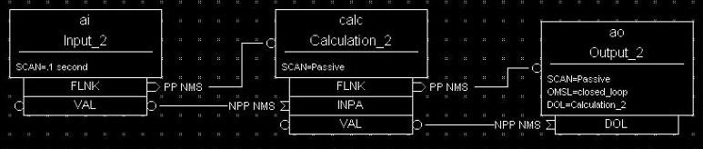
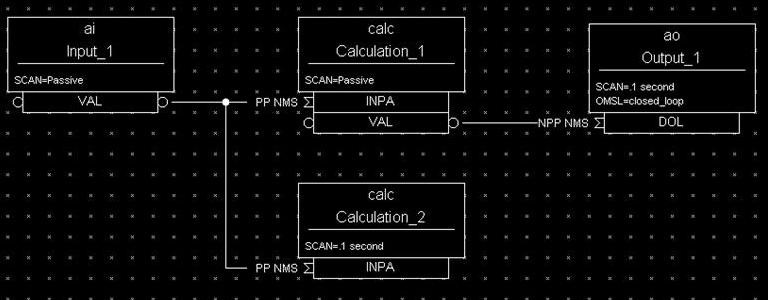

EPICS Process Database Concepts
===============================

.. tags:: beginner, user, developer 

.. contents:: Table of Contents
 :depth: 3

The EPICS Process Database
~~~~~~~~~~~~~~~~~~~~~~~~~~

An EPICS-based control system contains one or more Input Output
Controllers, IOCs. Each IOC loads one or more databases. A database
is a collection of records of various types.

A Record is an object with:

- A unique name
- A behavior defined by its type
- Controllable properties (fields)
- Optional associated hardware I/O (device support)
- Links to other records

There are several different types of records available. In addition to the
record types that are included in the EPICS base software package, it is
possible (although not recommended unless you absolutely need) to create
your own record type to perform some specific tasks.

Each record comprises a number of **fields**. Fields can have different
functions, typically they are used to configure how the record operates,
or to store data items.

Below are short descriptions for the most commonly used record types:

**Analog Input and Output (AI and AO)** records can store an
analog value, and are typically used for things like set-points,
temperatures, pressure, flow rates, etc.  The records perform number of
functions like data conversions, alarm processing, filtering, etc.

**Binary Input and Output (BI and BO)** records are generally used for
commands and statuses to and from equipment. As the name indicates, they store
binary values like On/Off, Open/Closed and so on.

**Calc and Calcout** records can access other records and perform a
calculation based on their values. (E.g. calculate the efficiency of a
motor by a function of the current and voltage input and output, and
converting to a percentage for the operator to read).

Database Functionality Specification
~~~~~~~~~~~~~~~~~~~~~~~~~~~~~~~~~~~~

This chapter covers the general functionality that is found in all
database records. The topics covered are I/O scanning, I/O address
specification, data conversions, alarms, database monitoring, and
continuous control:

-  *Scanning Specification* describes the various conditions under which
   a record is processed.

-  *Address Specification* explains the source of inputs and the
   destination of outputs.

-  *Conversion Specification* covers data conversions from transducer
   interfaces to engineering units.

-  *Alarm Specification* presents the many alarm detection mechanisms
   available in the database.

-  *Monitor Specification* details the mechanism, which notifies
   operators about database value changes.

-  *Control Specification* explains the features available for achieving
   continuous control in the database.

These concepts are essential in order to understand how the database
interfaces with the process.

The EPICS databases can be created by manual creation of a database
"myDatabase.db" text file or using visual tools (VDCT, CapFast). Visual
Database Configuration Tool (VDCT), a java application from Cosylab, is
a tool for database creation/editing that runs on Linux, Windows, and
Sun. The illustrations in this document have been created with VDCT.

Scanning Specification
~~~~~~~~~~~~~~~~~~~~~~

*Scanning* determines when a record is processed. A record is
*processed* when it performs any actions related to its data. For
example, when an output record is processed, it fetches the value which
it is to output, converts the value, and then writes that value to the
specified location. Each record must specify the scanning method that
determines when it will be processed. There are three scanning methods
for database records:

(1) periodic,

(2) event, and

(3) passive.

**Periodic** scanning occurs on set time intervals.

**Event** scanning occurs on either an I/O interrupt event or a
user-defined event.

**Passive** scanning occurs when the records linked to the passive
record are scanned, or when a value is "put" into a passive record
through the database access routines.

For periodic or event scanning, the user can also control the order in
which a set of records is processed by using the PHASE mechanism. The
number in the

PHAS field allows to define the relative order in which records are
processed within a scan cycle:

-  Records with PHAS=0 are processed first

-  Then those with PHAS=1, PHAS=2, etc.

For event scanning, the user can control the priority at which a record
will process. The PRIO field selects Low/Medium/High priority for Soft
event and I/O Interrupts.

In addition to the scan and the phase mechanisms, there are data links
and forward processing links that can be used to cause processing in
other records.

Periodic Scanning
-----------------

The periodic scan tasks run as close as possible to the specified
frequency. When each periodic scan task starts, it calls the gettime
routine, then processes all of the records on this period. After the
processing, gettime is called again and this thread sleeps the
difference between the scan period and the time to process the records.
For example, if it takes 100 milliseconds to process all records with “1
second” scan period, then the 1 second scan period will start again 900
milliseconds after completion. The following periods for scanning
database records are available by default, though EPICS can be
configured to recognize more scan periods:

-  10 second

-  5 second

-  2 second

-  1 second

-  .5 second

-  .2 second

-  .1 second

The period that best fits the nature of the signal should be specified.
A five-second interval is adequate for the temperature of a mass of
water because it does not change rapidly. However, some power levels may
change very rapidly, so they need to be scanned every 0.5 seconds. In
the case of a continuous control loop, where the process variable being
controlled can change quickly, the 0.1 second interval may be the best
choice.

For a record to scan periodically, a valid choice must be entered in its
SCAN field. Actually, the available choices depend on the configuration
of the menuScan.dbd file. As with most other fields which consists of a
menu of choices, the choices available for the SCAN field can be changed
by editing the appropriate .dbd (database definition) file. dbd files
are ASCII files that are used to generate header files that are, in
turn, are used to compile the database code. Many dbd files can be used
to configure other things besides the choices of menu fields.

Here is an example of a menuScan.dbd file, which has the default menu
choices for all periods listed above as well as choices for event
scanning, passive scanning, and I/O interrupt scanning:

.. code::

  menu(menuScan) {
    choice(menuScanPassive,"Passive")
    choice(menuScanEvent,"Event")
    choice(menuScanI_O_Intr,"I/O Intr")
    choice(menuScan10_second,"10 second")
    choice(menuScan5_second,"5 second")
    choice(menuScan2_second,"2 second")
    choice(menuScan1_second,"1 second")
    choice(menuScan_5_second,".5 second")
    choice(menuScan_2_second,".2 second")
    choice(menuScan_1_second,".1 second")
  }

The first three choices must appear first and in the order shown. The
remaining definitions are for the periodic scan rates, which must appear
in the order slowest to fastest (the order directly controls the thread
priority assigned to the particular scan rate, and faster scan rates
should be assigned higher thread priorities). At IOC initialization, the
menu choice strings are read at scan initialization. The number of
periodic scan rates and the period of each rate is determined from the
menu choice strings. Thus the periodic scan rates can be changed by
changing menuScan.dbd and loading this version via dbLoadDatabase. The
only requirement is that each periodic choice string must begin with a
number and be followed by any of the following unit strings:

  - second or second\ **s**
  - minute or minute\ **s**
  - hour or hour\ **s**
  - Hz or Hertz

For example, to add a
choice for 0.015 seconds, add the following line after the 0.1 second
choice:

.. code::

  choice(menuScan_015_second, " .015 second")

The range of values for scan periods can be from one clock tick to the
maximum number of ticks available on the system (for example, vxWorks
out of the box supports 0.015 seconds or a maximum frequency of 60 Hz).
Note, however, that the order of the choices is essential. The first
three choices must appear in the above order. Then the remaining choices
should follow in descending order, the biggest time period first and the
smallest last.

Event Scanning
--------------

There are two types of events supported in the input/output controller
(IOC) database, the I/O interrupt event and the user-defined event. For
each type of event, the user can specify the scheduling priority of the
event using the PRIO or priority field. The scheduling priority refers
to the priority the event has on the stack relative to other running
tasks. There are three possible choices: LOW, MEDIUM, or HIGH. A low
priority event has a priority a little higher than Channel Access. A
medium priority event has a priority about equal to the median of
periodic scanning tasks. A high priority event has a priority equal to
the event scanning task.

I/O Interrupt Events
--------------------

Scanning on I/O interrupt causes a record to be processed when a driver
posts an I/O Event. In many cases these events are posted in the
interrupt service routine. For example, if an analog input record gets
its value from an I/O card and it specifies I/O interrupt as its
scanning routine, then the record will be processed each time the card
generates an interrupt (not all types of I/O cards can generate
interrupts). Note that even though some cards cannot actually generate
interrupts, some driver support modules can simulate interrupts. In
order for a record to scan on I/O interrupts, its SCAN field must
specify I/O Intr.

User-defined Events
-------------------

The user-defined event mechanism processes records that are meaningful
only under specific circumstances. User-defined events can be generated
by the post_event() database access routine. Two records, the event
record and the timer record, are also used to post events. For example,
there is the timing output, generated when the process is in a state
where a control can be safely changed. Timing outputs are controlled
through Timer records, which have the ability to generate interrupts.
Consider a case where the timer record is scanned on I/O interrupt and
the timer record's event field (EVNT) contains an event number. When the
record is scanned, the user-defined event will be posted. When the event
is posted, all records will be processed whose SCAN field specifies
event and whose event number is the same as the generated event.
User-defined events can also be generated through software. Event
numbers are configurable and should be controlled through the project
engineer. They only need to be unique per IOC because they only trigger
processing for records in the same IOC.

All records that use the user-defined event mechanism must specify Event
in their SCAN field and an event number in their EVNT field.

Passive Scanning
----------------

Passive records are processed when they are referenced by other records
through their link fields or when a channel access put is done to them.

Channel Access Puts to Passive Scanned Records
----------------------------------------------

In this case where a channel access put is done to a record, the field
being written has an attribute that determines if this put causes record
processing. In the case of all records, putting to the VAL field causes
record processing. Consider a binary output that has a SCAN of Passive.
If an operator display has a button on the VAL field, every time the
button is pressed, a channel access put is sent to the record. When the
VAL field is written, the Passive record is processed and the specified
device support is called to write the newly converted RVAL to the device
specified in the OUT field through the device support specified by DTYP.
Fields determined to change the way a record behaves, typical cause the
record to process. Another field that would cause the binary output to
process would be the ZSV; which is the alarm severity if the binary
output record is in state Zero (0). If the record was in state 0 and the
severity of being in that state changed from No Alarm to Minor Alarm,
the only way to catch this on a SCAN Passive record is to process it.
Fields are configured to cause binary output records to process in the
bo.dbd file. The ZSV severity is configured as follows:

.. code::

  field(ZSV,DBF_MENU) {
    prompt("Zero Error Severity")
    promptgroup(GUI_ALARMS)
    pp(TRUE)
    interest(1)
    menu(menuAlarmSevr)
  }

where the line "pp(TRUE)" is the indication that this record is
processed when a channel access put is done.

Database Links to Passive Record
--------------------------------

The records in the process database use link fields to configure data
passing and scheduling (or processing). These fields are either INLINK,
OUTLINK, or FWDLINK fields.

Forward Links
-------------

In the database definition file (.dbd) these fields are defined as
follows:

.. code::

  field(FLNK,DBF_FWDLINK) {
    prompt("Forward Process Link")
    promptgroup(GUI_LINKS)
    interest(1)
  }

If the record that is referenced by the FLNK field has a SCAN field set
to “Passive”, then the record is processed after the record with the
FLNK. The FLNK field only causes record processing, no data is passed.
In (*Figure 1*), three records are shown. The ai record "Input_2" is
processed periodically. At each interval, Input_2 is processed. After
Input_2 has read the new input, converted it to engineering units,
checked the alarm condition, and posted monitors to Channel Access, then
the calc record "Calculation_2" is processed. Calculation_2 reads the
input, performs the calculation, checked the alarm condition, and posted
monitors to Channel Access, then the ao record "Output_2" is processed.
Output_2 reads the desired output, rate limits it, clamps the range,
calls the device support for the OUT field, checks alarms, posts
monitors and then is complete.

|image0|

**Figure 1. Input Links**

Input links normally fetch data from one field into a field in the
referring record. For instance, if the INPA field of a CALC record is
set to Input_3.VAL, then the VAL field is fetched from the Input_3
record and placed in the A field of the CALC record. These data links
have an attribute that specify if a passive record should be processed
before the value is returned. The default for this attribute is NPP (no
process passive). In this case, the record takes the VAL field and
returns it. If they are set to PP (process passive), then the record is
processed before the field is returned.

In *Figure 2*), the PP attribute is used. In this example, Output_3 is
processed periodically. Record processing first fetching the DOL field.
As the DOL field has the PP attribute set, before the VAL field of
Calc_3 is returned, the record is processed. The first thing done by the
ai record Input_3 does is to read the input. It then converts the RVAL
field to engineering units and places this in the VAL field, checks
alarms, posts monitors, and then returns. The calc record then fetches
the VAL field field from Input_3, places it in the A field, computes the
calculation, checks alarms, posts monitors, the returns. The ao record,
Output_3, then fetches the VAL field from the CALC record, applies rate
of change and limits, write the new value, checks alarms, posts monitors
and completes.

|image1|

**Figure 2**

In *Figure 3*)
the PP/NPP attribute is used to calculate a rate of change. At 1 Hz, the
calculation record is processed. It fetches the inputs for the calc
record in order. As INPA has an attribute of NPP, the VAL field is taken
from the ai record. Before INPB takes the VAL field from the ai record
it is processed, as the attribute on this link is PP. The new ai value
is placed in the B field of the calc record. A-B is the VAL field of the
ai one second ago and the current VAL field.

|image2|

**Figure 3**

Process Chains
^^^^^^^^^^^^^^

Links can be used to create complex scanning logic. In the forward link
example above, the chain of records is determined by the scan rate of
the input record. In the PP example, the scan rate of the chain is
determined by the rate of the output. Either of these may be appropriate
depending on the hardware and process limitations.

Care must be taken as this flexibility can also lead to some incorrect
configurations. In these next examples we look at some mistakes that can
occur.

In *Figure 4*) two records that are scanned at 10 Hz make references to
the same Passive record. In this case, no alarm or error is generated.
The Passive record is scanned twice at 10 Hz. The time between the two
scans depends on what records are processed between the two periodic
records.

|image3|

**Figure 4**

In *Figure 5*),
several circular references are made. As the record processing is
recursively called for links, the record containing the link is marked
as active during the entire time that the chain is being processed. When
one of these circular references is encountered, the active flag is
recognized and the request to process the record is ignored.

|image4|

**Figure 5**

Channel Access Links
--------------------

A Channel Access link is an input link or output link that specifies a
link to a record located in another IOC or an input and output link with
one of the following attributes: CA, CP, or CPP.

Channel Access Input Links
^^^^^^^^^^^^^^^^^^^^^^^^^^

If the input link specifies CA, CP, or CPP, regardless of the location
of the process variable being referenced, it will be forced to be a
Channel Access link. This is helpful for separating process chains that
are not tightly related. If the input link specifies CP, it also causes
the record containing the input link to process whenever a monitor is
posted, no matter what the record's SCAN field specifies. If the input
link specifies CPP, it causes the record to be processed if and only if
the record with the CPP link has a SCAN field set to Passive. In other
words, CP and CPP cause the record containing the link to be processed
with the process variable that they reference changes.

Channel Access Output Links
^^^^^^^^^^^^^^^^^^^^^^^^^^^

Only CA is appropriate for an output link. The write to a field over
channel access causes processing as specified in *Channel Access Puts to
Passive Scanned Records*.

Channel Access Forward Links
^^^^^^^^^^^^^^^^^^^^^^^^^^^^

Forward links can also be Channel Access links, either when they specify
a record located in another IOC or when they specify the CA attributes.
However, forward links will only be made Channel Access links if they
specify the PROC field of another record.

Maximize Severity Attribute
---------------------------

The Maximize Severity attribute is one of the following :

  - NMS (Non-Maximize Severity)
  - MS (Maximize Severity)
  - MSS (Maximize Status and Severity)
  - MSI (Maximize Severity if Invalid)

It determines whether alarm severity is
propagated across links. If the attribute is MSI only a severity of
INVALID_ALARM is propagated; settings of MS or MSS propagate all alarms
that are more severe than the record's current severity. For input links
the alarm severity of the record referred to by the link is propagated
to the record containing the link. For output links the alarm severity
of the record containing the link is propagated to the record referred
to by the link. If the severity is changed the associated alarm status
is set to LINK_ALARM, except if the attribute is MSS when the alarm
status will be copied along with the severity.

The method of determining if the alarm status and severity should be
changed is called \``maximize severity". In addition to its actual
status and severity, each record also has a new status and severity. The
new status and severity are initially 0, which means NO_ALARM. Every
time a software component wants to modify the status and severity, it
first checks the new severity and only makes a change if the severity it
wants to set is greater than the current new severity. If it does make a
change, it changes the new status and new severity, not the current
status and severity. When database monitors are checked, which is
normally done by a record processing routine, the current status and
severity are set equal to the new values and the new values reset to
zero. The end result is that the current alarm status and severity
reflect the highest severity outstanding alarm. If multiple alarms of
the same severity are present the alarm status reflects the first one
detected.

Phase
-----

The PHAS field is used to order the processing of records that are
scanned at the same time, i.e., records that are scanned periodically at
the same interval and priority, or that are scanned on the same event.
In this manner records dependent upon other records can be assured of
using current data.

To illustrate this we will look at an example from the previous section,
with the records, however, being scanned periodically instead of
passively (*Figure 6*). In this example each of these records specifies
.1 second; thus, the records are synchronous. The phase sequence is used
to assure that the analog input is processed first, meaning that it
fetches its value from the specified location and places it in the VAL
field (after any conversions). Next, the calc record will be processed,
retrieving its value from the analog input and performing its
calculation. Lastly, the analog output will be processed, retrieving its
desired output value from the calc record's VAL field (the VAL field
contains the result of the calc record's calculations) and writing that
value to the location specified it its OUT link. In order for this to
occur, the PHAS field of the analog input record must specify 0, the
PHAS field of the calculation record must specify 1, and the analog
output's PHAS field must specify 2.

|image11|

**Figure 6**

It is important to understand that in the above example, no record
causes another to be processed. The phase mechanism instead causes each
to process in sequence.

PVAccess Links
--------------

When built against Base >= 3.16.1, support is enabled for PVAccess
links, which are analogous to Channel Access (CA) links. However, the
syntax for PVA links is quite different.

The authoritative documentation is available in the git repository, `pva2pva. <https://epics-base.github.io/pva2pva/qsrv_page.html#qsrv_link>`_

.. note::

   The "dbjlr" and "dbpvar" IOC shell command provide information about
   PVA links in a running IOC.

A simple configuration using defaults is

.. code::

   record(longin, "tgt") {}
   record(longin, "src") {
     field(INP, {pva:"tgt"})
   }

This is a shorthand for

.. code::

   record(longin, "tgt") {}
   record(longin, "src") {
       field(INP, {pva:{pv:"tgt"}})
   }

Some additional keys (beyond "pv") may be used. Defaults are shown in
the example below:

.. code::

  record(longin, "tgt") {}
  record(longin, "src") {
    field(INP, {pva:{
      pv:"tgt",
      field:"", # may be a sub-field
      local:false,# Require local PV
      Q:4, # monitor queue depth
      pipeline:false, # require that server uses monitor
      # flow control protocol
      proc:none, # Request record processing
      #(side-effects).
      sevr:false, # Maximize severity.
      time:false, # set record time during getValue
      monorder:0, # Order of record processing as a result #of CP and CPP
      retry:false,# allow Put while disconnected.
      always:false,# CP/CPP input link process even when # .value field hasn't changed
      defer:false # Defer put
    }})
  }

pv: Target PV name
^^^^^^^^^^^^^^^^^^

The PV name to search for. This is the same name which could be used
with 'pvget' or other client tools.

field: Structure field name
^^^^^^^^^^^^^^^^^^^^^^^^^^^

The name of a sub-field of the remotely provided Structure. By default,
an empty string "" uses the top-level Structure.

If the top level structure, or a sub-structure is selected, then it is
expeccted to conform to NTScalar, NTScalarArray, or NTEnum to extract
value and meta-data.

If the sub-field is an PVScalar or PVScalarArray, then a value will be
taken from it, but not meta-data will be available.

local: Require local PV
^^^^^^^^^^^^^^^^^^^^^^^

When true, link will not connect unless the named PV is provided by the
local (QSRV) data provider.

Q: Monitor queue depth
^^^^^^^^^^^^^^^^^^^^^^

Requests a certain monitor queue depth. The server may, or may not, take
this into consideration when selecting a queue depth.

pipeline: Monitor flow control
^^^^^^^^^^^^^^^^^^^^^^^^^^^^^^

Expect that the server supports PVA monitor flow control. If not, then
the subscription will stall (ick.)

proc: Request record processing (side-effects)
^^^^^^^^^^^^^^^^^^^^^^^^^^^^^^^^^^^^^^^^^^^^^^

The meaning of this option depends on the direction of the link.

For output links, this option allows a request for remote processing
(side-effects).

-  none (default) - Make no special request. Uses a server specific
   default.

-  false, "NPP" - Request to skip processing.

-  true, "PP" - Request to force processing.

-  "CP", "CPP" - For output links, an alias for "PP".

For input links, this option controls whether the record containing the
PVA link will be processed when subscription events are received.

-  none (default), false, "NPP" - Do not process on subscription
   updates.

-  true, "CP" - Always process on subscription updates.

-  "PP", "CPP" - Process on subscription updates if SCAN=Passive

sevr: Alarm propagation
^^^^^^^^^^^^^^^^^^^^^^^

This option controls whether reading a value from an input PVA link has
the addition effect of propagating any alarm via the Maximize Severity
process.

-  false - Do not maximize severity.

-  true - Maximize alarm severity

-  "MSI" - Maximize only if the remote severity is INVALID.

time: Time propagation
^^^^^^^^^^^^^^^^^^^^^^

Somewhat analogous to sevr: applied to timestamp. When true, the record
TIME field is updated when the link value is read.

Warning

   TSEL must be set to -2 for time:true to have an effect.

monorder: Monitor processing order
^^^^^^^^^^^^^^^^^^^^^^^^^^^^^^^^^^

When multiple record target the same target PV, and request processing
on subscription updates. This option allows the order of processing to
be specified.

Record are processed in increasing order. monorder=-1 is processed
before monorder=0. Both are processed before monorder=1.

defer: Defer put
^^^^^^^^^^^^^^^^

By default (defer=false) an output link will immediately start a PVA Put
operation. defer=true will store the new value in an internal cache, but
not start a PVA Put.

This option, in combination with field: allows a single Put to contain
updates to multiple sub-fields.

retry: Put while disconnected
^^^^^^^^^^^^^^^^^^^^^^^^^^^^^

Allow a Put operation to be queued while the link is disconnected. The
Put will be executed when the link becomes connected.

always: CP/CPP always process
^^^^^^^^^^^^^^^^^^^^^^^^^^^^^

By default (always:false) a subscription update will only cause a CP
input link to scan if the structure field (cf. field: option) is marked
as changed. Set to true to override this, and always process the link.

Link semantics/behavior
^^^^^^^^^^^^^^^^^^^^^^^

This section attempts to answer some questions about how links behave in
certain situations.

Links are evaluated in three basic contexts.

-  dbPutLink()/dbScanFwdLink()

-  dbGetLink() of non-CP link

-  dbGetLink() during a scan resulting from a CP link.

An input link can bring in a Value as well as meta-data, alarm, time,
and display/control info. For input links, the PVA link engine attempts
to always maintain consistency between Value, alarm, and time. However,
consistency between these, and the display/control info is only ensured
during a CP scan.

Address Specification
~~~~~~~~~~~~~~~~~~~~~

Address parameters specify where an input record obtains input, where an
output record obtains its desired output values, and where an output
record writes its output. They are used to identify links between
records, and to specify the location of hardware devices. The most
common link fields are OUT, an output link, INP, an input link, and DOL
(desired output location), also an input link.

There are three basic types of address specifications, which can appear
in these fields: hardware addresses, database addresses, and constants.
Note that not all links support all three types, though some do. However,
this doesn't hold true for algorithmic records, which cannot specify
hardware addresses. Algorithm records are records like the Calculation,
PID, and Select records. These records are used to process values
retrieved from other records. Consult the documentation for each record.

Hardware Addresses
------------------

The interface between EPICS process database logic and hardware drivers
is indicated in two fields of records that support hardware interfaces:
DTYP and INP/OUT. The DTYP field is the name of the device support entry
table that is used to interface to the device. The address specification
is dictated by the device support. Some conventions exist for several
buses that are listed below. Lately, more devices have just opted to use
a string that is then parsed by the device support as desired. This
specification type is called INST I/O. The other conventions listed here
include: VME, Allen-Bradley, CAMAC, GPIB, BITBUS, VXI, and RF. The input
specification for each of these is different. The specification of these
strings must be acquired from the device support code or document.

INST
^^^^

The INST I/O specification is a string that is parsed by the device
support. The format of this string is determined by the device support.

@\ *parm*

  For INST I/O

    - @ precedes optional string *parm*

VME Bus
^^^^^^^

The VME address specification format differs between the various
devices. In all of these specifications the '#' character designates a
hardware address. The three formats are:

#C\ *x* S\ *y* @\ *parm*

  For analog in, analog out, and timer

    - C precedes the card number *x*
    - S precedes the signal number *y*
    - @ precedes optional string *parm*

The card number in the VME addresses refers to the logical card number.
Card numbers are assigned by address convention; their position in the
backplane is of no consequence. The addresses are assigned by the
technician who populates the backplane, with the logical numbers
welldocumented. The logical card numbers start with 0 as do the signal
numbers. *parm* refers to an arbitrary string of up to 31 characters and
is device specific.

Allen-Bradley Bus
^^^^^^^^^^^^^^^^^

The Allen-Bradley address specification is a bit more complicated as it
has several more fields. The '#' designates a hardware address. The
format is:

#L\ *a* A\ *b* C\ *c* S\ *d* @\ *parm'*
  All record types
    - L precedes the serial link number *a* and is optional - default 0
    - A precedes the adapter number *b* and is optional - default 0
    - C precedes the card number *c*
    - S precedes the signal number *d*
    - @ precedes optional string *parm*

The card number for Allen-Bradley I/O refers to the physical slot
number, where 0 is the slot directly to the right of the adapter card.
The AllenBradley I/O has 12 slots available for I/O cards numbered 0
through 11. Allen-Bradley I/O may use double slot addresses which means
that slots 0,2,4,6,8, and 10 are used for input modules and slots
1,3,5,7,9 and 11 are used for output modules. It's required to use the
double slot addressing mode when the 1771IL card is used as it only
works in double slot addressing mode. This card is required as it
provides Kilovolt isolation.

Camac Bus
^^^^^^^^^

The CAMAC address specification is similar to the Allen-Bradley address
specification. The '#' signifies a hardware address. The format is:

#B\ *a* C\ *b* N\ *c* A\ *d* F\ *e* @\ *parm*
  For waveform digitizers
    - B precedes the branch number *a* C precedes the crate number *b*
    - N precedes the station number *c*
    - A precedes the subaddress *d* (optional)
    - F precedes the function *e* (optional)
    - @ precedes optional string *parm*

The waveform digitizer supported is only one channel per card; no
channel was necessary.

Others
^^^^^^

The GPIB, BITBUS, RF, and VXI card-types have been added to the
supported I/O cards. A brief description of the address format for each
follows. For a further explanation, see the specific documentation on
each card.

#L\ *a* A\ *b* @\ *parm*
  For GPIB I/O

    - L precedes the link number *a*
    - A precedes the GPIB address *b*
    - @ precedes optional string *parm*

#L\ *a* N\ *b* P\ *c* S\ *d* @\ *parm*
  For BITBUS I/O
    - L precedes the link *a*, i.e., the VME bitbus interface
    - N precedes the bitbus node *b*
    - P precedes the port on node *c*
    - S precedes the signal on port *d*
    - @ precedes optional string *parm*

#V\ *a* C\ *b* S\ *c* @\ *parm*
  For VXI I/O, dynamic addressing
    - V precedes the VXI frame number *a*
    - C precedes the slot within VXI frame *b*
    - S precedes the signal number *c*
    - @ precedes optional string *parm*

#V\ *a* S\ *b* @\ *parm*
  For VXI I/O, static addressing
    - V precedes the logical address *a*
    - S precedes the signal number *b*
    - @ precedes optional string *parm*

Database Addresses
------------------

Database addresses are used to specify input links, desired output
links, output links, and forward processing links. The format in each
case is the same:

<RecordName>.<FieldName>

where RecordName is simply the name of the record being referenced, '.'
is the separator between the record name and the field name, and
FieldName is the name of the field within the record.

The record name and field name specification are case sensitive. The
record name can be a mix of the following: a-z A-Z 0-9 \_ - : . [ ] < >
;. The field name is always upper case. If no field name is specified as
part of an address, the value field (VAL) of the record is assumed.
Forward processing links do not need to include the field name because
no value is returned when a forward processing link is used; therefore,
a forward processing link need only specify a record name.

Basic typecast conversions are made automatically when a value is
retrieved from another record--integers are converted to floating point
numbers and floating point numbers are converted to integers. For
example, a calculation record which uses the value field of a binary
input will get a floating point 1 or 0 to use in the calculation,
because a calculation record's value fields are floating point numbers.
If the value of the calculation record is used as the desired output of
a multi-bit binary output, the floating point result is converted to an
integer, because multi-bit binary outputs use integers.

Records that use soft device support routines or have no hardware device
support routines are called *soft records*. See the chapter on each
record for information about that record's device support.

Constants
^^^^^^^^^

Input link fields and desired output location fields can specify a
constant instead of a hardware or database address. A constant, which is
not really an address, can be an integer value in whatever format (hex,
decimal, etc.) or a floating-point value. The value field is initialized
to the constant when the database is initialized, and at run-time the
value field can be changed by a database access routine. For instance, a
constant may be used in an input link of a calculation record. For
non-constant links, the calc record retrieves the values from the input
links, and places them in a corresponding value field. For constant
links, the value fields are initialized with the constant, and the
values can be changed by modifying the value field, not the link field.
Thus, because the calc record uses its value fields as the operands of
its expression, the constant becomes part of the calculation.

When nothing is specified in a link field, it is a NULL link. Before
Release 3.13, the value fields associated with the NULL link were
initialized with the value of zero. From Release 3.13 onwards, the value fields
associated with the links are not initialized.

A constant may also be used in the desired output location or DOL field
of an output record. In such a case, the initial desired output value
(VAL) will be that constant. Any specified conversions are performed on
the value before it is written as long as the device support module
supports conversions (the Soft Channel device support routine does not
perform conversions). The desired output value can be changed by an
operator at run-time by writing to the value field.

A constant can be used in an output link field, but no output will be
written if this is the case. Be aware that this is not considered an
error by the database checking utilities.

Conversion Specification
~~~~~~~~~~~~~~~~~~~~~~~~

Conversion parameters are used to convert transducer data into
meaningful data. Discrete signals require converting between levels and
states (i.e., on, off, high, low, etc.). Analog conversions require
converting between levels and engineering units (i.e., pressure,
temperature, level, etc.). These conversions are made to provide
operators and application codes with values in meaningful units.

The following sections discuss these types of conversions. The actual
field names appear in capital letters.

Discrete Conversions
--------------------

The most simple type of discrete conversion would be the case of a
discrete input that indicates the on/off state of a device. If the level
is high it indicates that the state of the device is on. Conversely, if
the level is low it indicates that the device is off. In the database,
parameters are available to enter strings which correspond to each
level, which, in turn, correspond to a state (0,1). By defining these
strings, the operator is not required to know that a specific transducer
is on when the level of its transmitter is high or off when the level is
low. In a typical example, the conversion parameters for a discrete
input would be entered as follows:

|  **Zero Name (ZNAM)**: Off
|  **One Name (ONAM)**: On

The equivalent discrete output example would be an on/off controller.
Let's consider a case where the safe state of a device is On, the zero
state. The level being low drives the device on, so that a broken cable
will drive the device to a safe state. In this example the database
parameters are entered as follows:

|  **Zero Name (ZNAM)**: On
|  **One Name (ONAM)**: Off

By giving the outside world the device state, the information is clear.
Binary inputs and binary outputs are used to represent such on/off
devices.

A more complex example involving discrete values is a multi-bit binary
output record. Consider a two state valve which has four
states-Traveling, full open, full closed, and disconnected. The bit
pattern for each control state is entered into the database with the
string that describes that state. The database parameters for the
monitor would be entered as follows:

|  **Number of Bits (NOBT):** 2
|  **First Input Bit Spec (INP):** Address of the least significant bit
|  **Zero Value (ZRVL):** 0
|  **One Value (ONVL):** 1
|  **Two Value (TWVL):** 2
|  **Three Value (THVL):** 3
|  **Zero String (ZRST):** Traveling
|  **One String (ONST):** Open
|  **Two String (TWST):** Closed
|  **Three String (THST):** Disconnected

In this case, when the database record is scanned, the monitor bits are
read and compared with the bit patterns for each state. When the bit
pattern is found, the device is set to that state. For instance, if the
two monitor bits read equal 10 (binary), the Two value is the corresponding
value, and the device would be set to state 2 which indicates that the
valve is Closed.

If the bit pattern is not found, the device is in an unknown state. In
this example all possible states are defined.

In addition, the DOL fields of binary output records (bo and mbbo) will
accept values in strings. When they retrieve the string or when the
value field is given a string via put_enum_strs, a match is sought with
one of the states. If a match is found, the value for that state is
written.

Analog Conversions
------------------

Analog conversions require knowledge of the transducer, the filters, and
the I/O cards. Together they measure the process, transmit the data, and
interface the data to the IOC. Smoothing is available to filter noisy
signals. The smoothing argument is a constant between 0 and 1 and is
specified in the SMOO field. It is applied to the converted hardware
signal as follows:

eng units = (new eng units × (1 - smoothing)) + (old eng units ×
smoothing)

The analog conversions from raw values to engineering units can be
either linear or breakpoint conversions.

Whether an analog record performs linear conversions, breakpoint
conversions, or no conversions at all depends on how the record's LINR
field is configured. The possible choices for the LINR field are as
follows:

  - LINEAR
  - SLOPE
  - NO CONVERSION
  - typeKdegF
  - typeKdegC
  - typeJdegF
  - typeJdegC

If either LINEAR or SLOPE is chosen, the record performs a linear conversion on the
data. If NO CONVERSION is chosen, the record performs no conversion on
its data. The other choices are the names of breakpoint tables. When one
of these is specified in the LINR field, the record uses the specified
table to convert its data. 

.. note::
  Additional breakpoint tables are
  often added at specific sites, so more breakpoint tables than are listed
  here may be available at the user's site. 
  
The following sections explain linear and breakpoint conversions.

Linear Conversions
------------------

The engineering units full scale and low scale are specified in the EGUF
and EGUL fields, respectively. The values of the EGUF and EGUL fields
correspond to the maximum and minimum values of the transducer,
respectively. Thus, the value of these fields is device dependent. For
example, if the transducer has a range of -10 to +10 volts, then the
EGUF field should be 10 and the EGUL field should be -10. In all cases,
the EGU field is a string that contains the text to indicate the units
of the value.

The distinction between the LINEAR and SLOPE settings for the LINR field are
in how the conversion parameters are calculated:

With LINEAR conversion the user must set EGUL and EGUF to the lowest and highest
possible engineering units values respectively that can be converted by the
hardware. The device support knows the range of the raw data and calculates
ESLO and EOFF from them.

SLOPE conversion requires the user to calculate the appropriate scaling and
offset factors and put them directly in ESLO and EOFF.

There are three formulas to know when considering the linear conversion
parameters. The conversion from measured value to engineering units is
as follows:

.. math::

  \text{engunits} = \text{eng units low} + \frac{\text{ measured A/D counts}}{\text{full scale A/D counts}} * (\text{eng units full scale - eng units low})

In the following examples the determination of engineering units full
scale and low scale is shown. The conversion to engineering units is
also shown to familiarize the reader with the signal conversions from
signal source to database engineering units.

Transducer Matches the I/O module
^^^^^^^^^^^^^^^^^^^^^^^^^^^^^^^^^

First let us consider a linear conversion. In this example, the
transducer transmits 0-10 Volts, there is no amplification, and the I/O
card uses a 0-10 Volt interface.

|image5|

The transducer transmits pressure: 0 PSI at 0 Volts and 175 PSI at 10
Volts. The engineering units full scale and low scale are determined as
follows:

| eng. units full scale = 17.5 × 10.0
| eng. units low scale = 17.5 × 0.0

The field entries in an analog input record to convert this pressure
will be as follows:

| **LINR:** Linear
| **EGUF:** 175.0
| **EGUL:** 0
| **EGU:** PSI

The conversion will also take into account the precision of the I/O
module. In this example (assuming a 12 bit analog input card) the
conversion is as follows:

.. math::

  \text{eng units} = 0 + \frac{\text{ measured A/D counts}}{4095} * (175 - 0)

When the pressure is 175 PSI, 10 Volts is sent to the I/O module. At 10
Volts the signal is read as 4095. When this is plugged into the
conversion, the value is 175 PSI.

Transducer Lower than the I/O module
^^^^^^^^^^^^^^^^^^^^^^^^^^^^^^^^^^^^

Let's consider a variation of this linear conversion where the
transducer is 0-5 Volts.

|image6|

In this example the transducer is producing 0 Volts at 0 PSI and 5 Volts
at 175 PSI. The engineering units full scale and low scale are
determined as follows:

eng. units low scale = 35 × 10 eng. units full scale = 35 × 0

The field entries in an analog record to convert this pressure will be
as follows:

| **LINR:** Linear
| **EGUF:** 350
| **EGUL:** 0
| **EGU:** PSI

The conversion will also take into account the precision of the I/O
module. In this example (assuming a 12 bit analog input card) the
conversion is as follows:

.. math::

  \text{eng units} = 0 + \frac{\text{ measured A/D counts}}{4095} * (350 - 0)

Notice that at full scale the transducer will generate 5 Volts to
represent 175 PSI. This is only half of what the input card accepts;
input is 2048.

Let's plug in the numbers to see the result:

.. math::

  0 + (2048 / 4095) * (350 - 0) = 175

In this example we had to adjust the engineering units full scale to
compensate for the difference between the transmitter and the analog
input card.

Transducer Positive and I/O module bipolar
^^^^^^^^^^^^^^^^^^^^^^^^^^^^^^^^^^^^^^^^^^

Let's consider another variation of this linear conversion where the
input card accepts -10 Volts to 10 Volts (i.e. Bipolar instead of
Unipolar).

|image7|

In this example the transducer is producing 0 Volts at 0 PSI and 10
Volts at 175 PSI. The input module has a different range of voltages and
the engineering units full scale and low scale are determined as
follows:

eng. units full scale = 17.5 × 10 eng. units low scale = 17.5 × (-10)

The database entries to convert this pressure will be as follows:

| **LINR:** Linear
| **EGUF:** 175
| **EGUL:** -175
| **EGU:** PSI

The conversion will also take into account the precision of the I/O
module. In this example (assuming a 12 bit analog input card) the
conversion is as follows:

.. math::

  \text{eng units} = -175 + \frac{\text{ measured A/D counts}}{4095} * (175 - (-175))

Notice that at low scale the transducer will generate 0 Volts to
represent 0 PSI. Because this is half of what the input card accepts, it
is input as 2048. Let's plug in the numbers to see the result:

.. math::

  -175 + (2048 / 4095) * (175 - (-175)) = 0

In this example we had to adjust the engineering units low scale to
compensate for the difference between the unipolar transmitter and the
bipolar analog input card.

Combining Linear Conversion with an Amplifier
^^^^^^^^^^^^^^^^^^^^^^^^^^^^^^^^^^^^^^^^^^^^^

Let's consider another variation of this linear conversion where the
input card accepts -10 Volts to 10 Volts, the transducer transmits 0 - 2
Volts for 0 - 175 PSI and a 2x amplifier is on the transmitter.

|image8|

At 0 PSI the transducer transmits 0 Volts. This is amplified to 0 Volts.
At half scale, it is read as 2048. At 175 PSI, full scale, the
transducer transmits 2 Volts, which is amplified to 4 Volts. The analog
input card sees 4 Volts as 70 percent of range or 2867 counts. The
engineering units full scale and low scale are determined as follows:

| eng units full scale = 43.75 × 10
| eng units low scale = 43.75 × (-10)

(175 / 4 = 43.75) The record's field entries to convert this pressure
will be as follows:

| **LINR** Linear
| **EGUF** 437.5
| **EGUL** -437.5
| **EGU** PSI

The conversion will also take into account the precision of the I/O
module. In this example (assuming a 12 bit analog input card) the
conversion is as follows:

.. math::

  \text{eng units} = -437.5 + \frac{\text{ measured A/D counts}}{4095} * (437.5 - (-437.5))

Notice that at low scale the transducer will generate 0 Volts to
represent 0 PSI. Because this is half of what the input card accepts, it
is input as 2048. Let's plug in the numbers to see the result:

.. math::

  -437.5 + (2048 / 4095) * (437.5 - (-437.5)) = 0

Notice that at full scale the transducer will generate 2 volts which
represents 175 PSI. The amplifier will change the 2 Volts to 4 Volts. 4
Volts is 14/20 or 70 percent of the I/O card's scale. The input from the
I/O card is therefore 2866 (i.e., 0.7 \* 4095). Let's plug in the
numbers to see the result:

.. math::

  -437.5 + (2866 / 4095) * (437.5 - (-437.5)) = 175 PSI

We had to adjust the engineering units full scale to adjust for the
difference between the transducer with the amplifier affects and the
range of the I/O card. We also adjusted the low scale to compensate for
the difference between the unipolar transmitter/amplifier and the
bipolar analog input card.

Breakpoint Conversions
----------------------

Now let us consider a non-linear conversion. These are conversions that
could be entered as polynomials. As these are more time consuming to
execute, a breakpoint table is created that breaks the non-linear
conversion into linear segments that are accurate enough.

Breakpoint Table
^^^^^^^^^^^^^^^^

The breakpoint table is then used to do a piecewise linear conversion.
Each piecewise segment of the breakpoint table contains:

Raw Value Start for this segment, Engineering Units at the start.

.. code::

     breaktable(typeJdegC) {
        0.000000 0.000000
        365.023224 67.000000
        1000.046448 178.000000
        3007.255859 524.000000
        3543.383789 613.000000
        4042.988281 692.000000
        4101.488281 701.000000
     }

Breakpoint Conversion Example
^^^^^^^^^^^^^^^^^^^^^^^^^^^^^

When a new raw value is read, the conversion routine starts from the
previously used line segment, compares the raw value start, and either going
forward or backward in the table searches the proper segment for this new
raw value. Once the proper segment is found, the new engineering units
value is the engineering units value at the start of this segment plus
the slope of this segment times the position on this segment.

  value = eng.units at segment start + (raw value - raw at segment start) * slope

A table that has an entry for each possible raw count is effectively a look up
table.

Breakpoint tables are loaded to the IOC using the *dbLoadDatabase* shell function.
The slope corresponding to each segment is calculated when the table is loaded.
For raw values that exceed the last point in the breakpoint table, the slope of
the last segment is used.

In this example the transducer is a thermocouple which transmits 0-20
milliAmps. An amplifier is present which amplifies milliAmps to volts.
The I/O card uses a 0-10 Volt interface and a 12-bit ADC.
Raw value range would thus be 0 to 4095.

 |image9|

The transducer is transmitting temperature. The database entries in the
analog input record that are needed to convert this temperature will be
as follows:

| **LINR** typeJdegC
| **EGUF** 0
| **EGUL** 0
| **EGU** DGC

For analog records that use breakpoint tables, the EGUF and EGUL fields
are not used in the conversion, so they do not have to be given values.

With this example setup and assuming we get an ADC raw reading of 3500, the formula above would give:

Value = 524.0 + (3500 - 3007) * 0.166 = 605.838 DGC

EPICS Base distribution currently includes lookup tables for J and K thermocouples in degrees F
and degrees C.

Other potential applications for a lookup table are e.g. other types of
thermocouples, logarithmic output controllers, and exponential
transducers. The piece-wise linearization of the signals provides a mechanism for conversion
that minimizes the amount of floating point arithmetic required to
convert non-linear signals. Additional breakpoint tables can be added to
the predefined ones.

Creating Breakpoint Tables
^^^^^^^^^^^^^^^^^^^^^^^^^^

There are two ways to create a new breakpoint table:

1) Simply type in the data for each segment, giving the raw and
corresponding engineering unit value for each point in the following
format.

.. code::

  breaktable(<tablename>) {
    <first point> <first eng units>
    <next point> <next eng units>
    <etc.> <...>
  }

where the <tablename> is the name of the table, such as typeKdegC, and
<first point> is the raw value of the beginning point for each line
segment, and <first eng units> is the corresponding engineering unit
value. The slope is calculated by the software and should not be
specified.

2) Create a file consisting of a table of an arbitrary number of values in
engineering units and use the utility called **makeBpt** to convert the
table into a breakpoint table. As an example, the contents data file to
create the typeJdegC breakpoint table look like this:

.. code::

  !header
  "typeJdegC" 0 0 700 4095 .5 -210 760 1
  !data
  -8.096 -8.076 -8.057 <many more numbers>

The file name must have the extension .data. The file must first have a
header specifying these nine things:

1. Name of breakpoint table in quotes: **"typeJdegC"**
2. Engineering units for 1st breakpoint table entry: **0**
3. Raw value for 1st breakpoint table entry: **0**
4. Highest value desired in engineering units: **700**
5. Raw value corresponding to high value in engineering units: **4095**
6. Allowed error in engineering units: **.5**
7. Engineering units corresponding to first entry in data table: **-210**
8. Engineering units corresponding to last entry in data table: **760**
9. Change in engineering units between data table entries: **1**

The rest of the file contains lines of equally spaced engineering
values, with each line no more than 160 characters before the new-line
character. The header and the actual table should be specified by
**!header** and **!data**, respectively. The file for this data table is called
typeJdegC.data, and can be converted to a breakpoint table with the
**makeBpt** utility as follows:

unix% makeBpt typeJdegC.data

Alarm Specification
~~~~~~~~~~~~~~~~~~~

There are two elements to an alarm condition: the alarm *status* and the
*severity* of that alarm. Each database record contains its current
alarm status and the corresponding severity for that status. The scan
task, which detects these alarms, is also capable of generating a
message for each change of alarm state. The types of alarms available
fall into these categories: scan alarms, read/write alarms, limit
alarms, and state alarms. Some of these alarms are configured by the
user, and some are automatic which means that they are called by the
record support routines on certain conditions, and cannot be changed or
configured by the user.

Alarm Severity
--------------

An alarm *severity* is used to give weight to the current alarm status.
There are four severities:

  - NO_ALARM
  - MINOR
  - MAJOR
  - INVALID

NO_ALARM means no alarm has been triggered. An alarm state that needs
attention but is not dangerous is a MINOR alarm. In this instance the
alarm state is meant to give a warning to the operator. A serious state
is a MAJOR alarm. In this instance the operator should give immediate
attention to the situation and take corrective action. An INVALID alarm
means there's a problem with the data, which can be any one of several
problems; for instance, a bad address specification, device
communication failure, or signal is over range. In these cases, an alarm
severity of INVALID is set. An INVALID alarm can point to a simple
configuration problem or a serious operational problem.

For limit alarms and state alarms, the severity can be configured by the
user to be MAJOR or MINOR for the a specified state. For instance, an
analog record can be configured to trigger a MAJOR alarm when its value
exceeds 175.0. In addition to the MAJOR and MINOR severity, the user can
choose the NO_ALARM severity, in which case no alarm is generated for
that state.

For the other alarm types (i.e., scan, read/write), the severity is
always INVALID and not configurable by the user.

Alarm Status
------------

Alarm status is a field common to all records. The field is defined as
an enumerated field. The possible states are listed below.

   - NO_ALARM: This record is not in alarm
   - READ: An INPUT link failed in the device support
   - WRITE: An OUTPUT link failed in the device support
   - HIHI: An analog value limit alarm
   - HIGH: An analog value limit alarm
   - LOLO: An analog value limit alarm
   - LOW: An analog value limit alarm
   - STATE: An digital value state alarm
   - COS: An digital value change of state alarm
   - COMM: A device support alarm that indicates the device is not communicating
   - TIMEOUT: A device sup alarm that indicates the asynchronous device timed out
   - HWLIMIT: A device sup alarm that indicates a hardware limit alarm
   - CALC: A record support alarm for calculation records indicating a bad calculation
   - SCAN: An invalid SCAN field is entered
   - LINK: Soft device support for a link failed:no record, bad field, invalid conversion, INVALID alarm severity on the referenced record.
   - SOFT
   - BAD_SUB
   - UDF
   - DISABLE
   - SIMM
   - READ_ACCESS
   - WRITE_ACCESS

There are a number of issues with this field and menu.

-  The maximum enumerated strings passed through channel access is 16 so
   nothing past SOFT is seen if the value is not requested by Channel
   Access as a string.

-  Only one state can be true at a time so that the root cause of a
   problem or multiple problems are masked. This is particularly obvious
   in the interface between the record support and the device support.
   The hardware could have some combination of problems and there is no
   way to see this through the interface provided.

-  The list is not complete.

-  In short, the ability to see failures through the STAT field are
   limited. Most problems in the hardware, configuration, or
   communication are reduced to READ or WRITE error and have their
   severity set to INVALID. When you have an INVALID alarm severity,
   some investigation is currently needed to determine the fault. Most
   EPICS drivers provide a report routine that dumps a large set of
   diagnostic information. This is a good place to start in these cases.

Alarm Conditions Configured in the Database
-------------------------------------------

When you have a valid value, there are fields in the record that allow
the user to configure off normal conditions. For analog values these are
limit alarms. For discrete values, these are state alarms.

Limit Alarms
^^^^^^^^^^^^

For analog records (this includes such records as the stepper motor
record), there are configurable alarm limits. There are two limits for
above normal operating range and two limits for the below-limit
operating range. Each of these limits has an associated alarm severity,
which is configured in the database. If the record's value drops below
the low limit and an alarm severity of MAJOR was specified for that
limit, then a MAJOR alarm is triggered. When the severity of a limit is set to
NO_ALARM, none will be generated, even if the limit entered has been
violated.

There are two limits at each end, two low values and two high values, so
that a warning can be set off before the value goes into a dangerous
condition.

Analog records also contain a hysteresis field, which is also used when
determining limit violations. The hysteresis field is the deadband
around the alarm limits. The deadband keeps a signal that is hovering at
the limit from generating too many alarms. Let's take an example
(*Figure 8*) where the range is -100 to 100 volts, the high alarm limit
is 30 Volts, and the hysteresis is 10 Volts. If the value is normal and
approaches the HIGH alarm limit, an alarm is generated when the value
reaches 30 Volts. This will only go to normal if the value drops below
the limit by more than the hysteresis. For instance, if the value
changes from 30 to 28 this record will remain in HIGH alarm. Only when
the value drops to 20 will this record return to normal state.

**Figure 8**

|image10|

State Alarms
^^^^^^^^^^^^

For discrete values there are configurable state alarms. In this case a
user may configure a certain state to be an alarm condition. Let's
consider a cooling fan whose discrete states are high, low, and off. The
off state can be configured to be an alarm condition so that whenever
the fan is off the record is in a STATE alarm. The severity of this
error is configured for each state. In this example, the low state could
be a STATE alarm of MINOR severity, and the off state a STATE alarm of
MAJOR severity.

Discrete records also have a field in which the user can specify the
severity of an unknown state to NO_ALARM, MINOR or MAJOR. Thus, the
unknown state alarm is not automatic.

Discrete records also have a field, which can specify an alarm when the
record's state changes. Thus, an operator can know when the record's
alarm state has changed. If this field specifies NO_ALARM, then a change
of state will not trigger a change of state alarm. However, if it
specifies either MINOR or MAJOR, a change of state will trigger an alarm
with the corresponding severity.

Alarm Handling
--------------

A record handles alarms with the NSEV, NSTA, SEVR, and STAT fields. When
a software component wants to raise an alarm, it first checks the new
alarm state fields: NSTA, new alarm state, and NSEV, new alarm severity.
If the severity in the NSEV field is higher than the severity in the
current severity field (SEVR), then the software component sets the NSTA
and NSEV fields to the severity and alarm state that corresponds to the
outstanding alarm. When the record process routine next processes the
record, it sets the current alarm state (STAT) and current severity

(SEVR) to the values in the NSEV and NSTA fields. This method of
handling alarms ensures that the current severity (STAT) reflects the

highest severity of outstanding alarm conditions instead of simply the
last raised alarm. This also means that the if multiple alarms of equal
severity are present, the alarm status indicates the first one detected.

In addition, the get_alarm_double() routine can be called to format an
alarm message and send it to an alarm handler. The alarm conditions may
be monitored by the operator interface by explicitly monitoring the STAT
and SEVR fields. All values monitored by the operator interface are
returned from the database access with current status information.

Monitor Specification
~~~~~~~~~~~~~~~~~~~~~

EPICS provides the methods for clients to subscribe to be informed of
changes in a PV; in EPICS vocabulary this method is called “monitor”.

In Channel Access, as well as PVAccess clients connect to PVs to put,
get, or monitor. There are fields in the EPICS records that help limit
the monitors posted to these clients through the CA or PVA Server. These
fields most typically apply when the client is monitoring the VAL field
of a record. Most other fields post a monitor whenever they are changed.
For instance, a put to an alarm limit, causes a monitor to be posted to
any client that is monitoring that field. The client can select…

For more information about using monitors, see the Channel Access
Reference Guide.

Rate Limits
-----------

The inherent rate limit is the rate at which the record is scanned.
Monitors are only posted when the record is processed as a minimum.
There are currently no mechanisms for the client to rate limit a
monitor. If a record is being processed at a much higher rate than an
application wants, either the database developer can make a second
record at a lower rate and have the client connect to that version of
the record or the client can disregard the monitors until the time stamp
reflects the change.

Channel Access Deadband Selection
^^^^^^^^^^^^^^^^^^^^^^^^^^^^^^^^^

The Channel Access client can set a mask to indicate which alarm change
it wants to monitor. There are three: value change, archive change, and
alarm change.

Value Change Monitors
^^^^^^^^^^^^^^^^^^^^^

The value change monitors are typically sent whenever a field in the
database changes. The VAL field is the exception. If the MDEL field is
set, then the VAL field is sent when a monitor is set, and then only
sent again, when the VAL field has changed by MDEL.

..note:: 

  A MDEL of 0 sends a monitor whenever the VAL fields changes and an MDEL of -1
  sends a monitor whenever the record is processed as the MDEL is applied
  to the absolute value of the difference between the previous scan and
  the current scan. An MDEL of -1 is useful for scalars that are triggered
  and a positive indication that the trigger occurred is required.

Archive Change Monitors
^^^^^^^^^^^^^^^^^^^^^^^

The archive change monitors are typically sent whenever a field in the
database changes. The VAL field is the exception. If the ADEL field is
set, then the VAL field is sent when a monitor is set, and then only
sent again, when the VAL field has changed by ADEL.

Alarm Change Monitors
^^^^^^^^^^^^^^^^^^^^^

The alarm change monitors are only sent when the alarm severity or
status change. As there are filters on the alarm condition checking, the
change of alarm status or severity is already filtered through those
mechanisms. These are described in *Alarm Specification*.

Metadata Changes
^^^^^^^^^^^^^^^^

When a Channel Access Client connects to a field, it typically requests
some metadata related to that field. One case is a connection from an
operator interface typically requests metadata that includes: display
limits, control limits, and display information such as precision and
engineering units. If any of the fields in a record that are included in
this metadata change after the connection is made, the client is not
informed and therefore this is not reflected unless the client
disconnects and reconnects. A new flag is being added to the Channel
Access Client to support posting a monitor to the client whenever any of
this metadata changes. Clients can then request the metadata and reflect
the change.

Stay tuned for this improvement in the record support and channel access
clients.

Client specific Filtering
-------------------------

Several situation have come up that would be useful. These include event
filtering, rate guarantee, rate limit, and value change.

Event Filtering
^^^^^^^^^^^^^^^

There are several cases where a monitor was sent from a channel only
when a specific event was true. For instance, there are diagnostics that
are read at 1 kHz. A control program may only want this information when
the machine is producing a particular beam such as a linac that has
several injectors and beam lines. These are virtual machines that want
to be notified when the machine is in their mode. These modes can be
interleaved at 60 Hz in some cases. A fault analysis tool may only be
interested in all of this data when a fault occurs and the beam is
dumped.

There are two efforts here: one at LANL and one from ANL/BNL. These
should be discussed in the near future.

Rate Guarantee
^^^^^^^^^^^^^^

Some clients may want to receive a monitor at a given rate. Binary
inputs that only notify on change of state may not post a monitor for a
very long time. Some clients may prefer to have a notification at some
rate even when the value is not changing.

Rate Limit
^^^^^^^^^^

There is a limit to the rate that most clients care to be notified.
Currently, only the SCAN period limits this. A user-imposed limit is
needed in some cases such as a data archiver that would only want this
channel at 1 Hz (all channels on the same 1 msec in this case).

Value Change
^^^^^^^^^^^^

Different clients may have a need to set different deadbands among them.
No specific case is cited.

Control Specification
~~~~~~~~~~~~~~~~~~~~~

A control loop is a set of database records used to maintain control
autonomously. Each output record has two fields that are help implement
this independent control: the desired output location field (DOL) and
the output mode select field (OMSL). The OMSL field has two mode
choices: closed_loop or supervisory. When the closed loop mode is
chosen, the desired output is retrieved from the location specified by
the DOL field and placed into the VAL field. When the supervisory mode
is chosen, the desired output value is the VAL field. In supervisory
mode the DOL link is not retrieved. In the supervisory mode, VAL is set
typically by the operator through a Channel Access "Put".

Closing an Analog Control Loop
------------------------------

In a simple control loop an analog input record reads the value of a
process variable or PV. The operator sets the Setpoint in the PID
record. Then, a PID record retrieves the value from the analog input
record and computes the error - the difference between the readback and
the setpoint. The PID record computes the new output setting to move the
process variable toward the setpoint. The analog output record gets the
value from the PID through the DOL when the OMSL is closed_loop. It sets
the new output and on the next period repeats this process.

Configuring an Interlock
------------------------

When certain conditions become true in the process, it may trip an
interlock. The result of this interlock is to move something into a safe
state or to mitigate damage by taking some action. One example is the
closing of a vacuum valve to isolate a vacuum loss. When a vacuum
reading in one region of a machine is not at the operating range, an
interlock is used to either close a valve and prohibit it from being
open. This can be implemented by reading several vacuum gauges in an
area into a calculation record. The expression in the calculation record
can express the condition that permits the valve to open. The result of
the expression is then referenced to the DOL field of a binary output
record that controls the valve. If the binary output has the OMSL field
set to closed_loop it sets the valve to the value of the calculation
record. If it is set to supervisory, the operator can override the
interlock and control the valve directly.

.. |image1| image:: media/dbconcepts/image2.jpg
   :width: 6.46852in
   :height: 1.18351in
.. |image2| image:: media/dbconcepts/image3.jpeg
   :width: 4.55556in
   :height: 1.59722in

.. |image4| image:: media/dbconcepts/image5.jpeg
   :width: 6.45972in
   :height: 2.65069in
.. |image5| image:: media/dbconcepts/image6.png
   :width: 3.90278in
   :height: 0.70833in
.. |image6| image:: media/dbconcepts/image7.png
   :width: 3.90278in
   :height: 0.75in
.. |image7| image:: media/dbconcepts/image8.png
   :width: 3.90278in
   :height: 0.75in
.. |image8| image:: media/dbconcepts/image9.png
   :width: 3.90278in
   :height: 0.65278in
.. |image9| image:: media/dbconcepts/image10.png
   :width: 3.90278in
   :height: 0.80556in
.. |image10| image:: media/dbconcepts/image11.png
   :width: 3.90278in
   :height: 1.94444in
.. |image11| image:: media/dbconcepts/Concepts-6.png
      :width: 7.64in
      :height: 2.36in
